# 🏗️ ARCHITECTURE — RateGuard Rate Limiting Microservice

<div align="center">

> A deep technical reference covering every architectural decision, design pattern, data structure, and trade-off in the RateGuard system.

**Version:** 2.0.0 &nbsp;|&nbsp; **Updated:** March 2026 &nbsp;|&nbsp; **Status:** Production-Ready

</div>

---

## 📑 Table of Contents

1. [Objective & Core Idea](#1-objective--core-idea)
2. [High-Level Architecture](#2-high-level-architecture)
3. [Layered Architecture](#3-layered-architecture)
4. [Module Responsibilities](#4-module-responsibilities)
5. [Why Token Bucket?](#5-why-token-bucket)
6. [Lua Script — Atomic Rate Decision](#6-lua-script--atomic-rate-decision)
7. [Request Lifecycle Diagrams](#7-request-lifecycle-diagrams)
8. [Data Design](#8-data-design)
9. [API Design Decisions](#9-api-design-decisions)
10. [Security Architecture](#10-security-architecture)
11. [CI/CD Architecture](#11-cicd-architecture)
12. [Dockerfile Architecture](#12-dockerfile-architecture)
13. [Scalability & Reliability](#13-scalability--reliability)
14. [Observability Architecture](#14-observability-architecture)
15. [Pros, Cons & Trade-offs](#15-pros-cons--trade-offs)
16. [Production Recommendations](#16-production-recommendations)

---

## 1. Objective & Core Idea

RateGuard is a **dedicated, stateless microservice** that enforces per-client, per-endpoint API rate limits across a distributed system. It removes rate-limiting logic from individual application services and centralises it in a single, reliable, horizontally-scalable layer.

```mermaid
mindmap
  root((RateGuard))
    Core Goals
      Zero race conditions
      Horizontal scalability
      Per-client policies
      One-command setup
    Algorithm
      Token Bucket
      Redis Lua EVAL
      Burst tolerance
      O(1) state per client
    Storage
      MongoDB
        Client policies
        Hashed API keys
        bcryptRounds configurable
      Redis
        Token bucket state
        TTL auto-expiry
        ioredis-mock for unit tests
    API Surface
      POST /api/v1/clients
      GET /api/v1/clients/:clientId
      POST /api/v1/ratelimit/check
      GET /health
      X-RateLimit-* headers
    Operations
      4-stage multi-stage Docker
      .dockerignore for lean builds
      GitHub Actions CI
      GHA layer cache
      Structured logging
```

**Key design philosophies:**
- **Stateless compute, stateful storage** — app nodes hold no in-memory rate state; all state lives in Redis
- **Separation of concerns** — client policy (MongoDB) vs. volatile rate state (Redis) vs. business logic (Node.js)
- **Standard HTTP semantics** — `X-RateLimit-Limit/Remaining/Reset` headers on every rate-limit response
- **Fail loudly, log verbosely** — 4xx errors carry clear human messages; 500s return generic strings with full detail in server logs
- **Testing as a first-class concern** — pure math module decoupled for unit testing without I/O; Redis logic unit-tested via `ioredis-mock`

---

## 2. High-Level Architecture

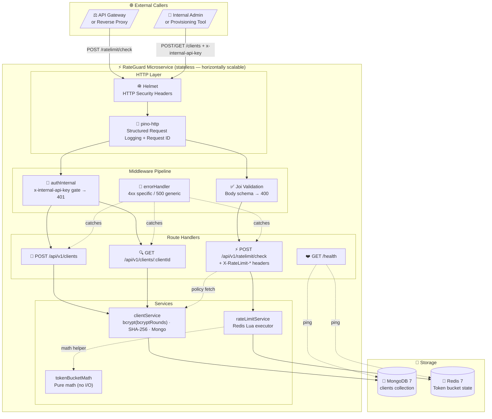

---

## 3. Layered Architecture

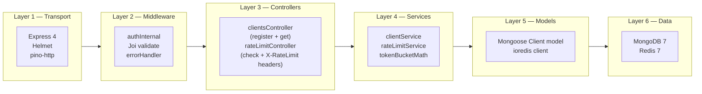

| Layer | Technology | Responsibility |
|---|---|---|
| **Transport** | Express 4, Helmet, pino-http | HTTP routing, security headers, structured request logging |
| **Middleware** | Joi, custom auth, errorHandler | Input validation → 400, auth gate → 401, error normalisation |
| **Controllers** | Express handlers | Use-case orchestration, HTTP response shaping + X-RateLimit-* headers |
| **Services** | bcrypt, ioredis, Lua, crypto | Business logic: register client, evaluate rate limit |
| **Models** | Mongoose | MongoDB schema + unique index enforcement |
| **Data** | MongoDB 7, Redis 7 | Persistent policy store + ephemeral rate state |
| **Infra** | Docker Compose, GitHub Actions | Reproducible environments, CI/CD automation |

---

## 4. Module Responsibilities

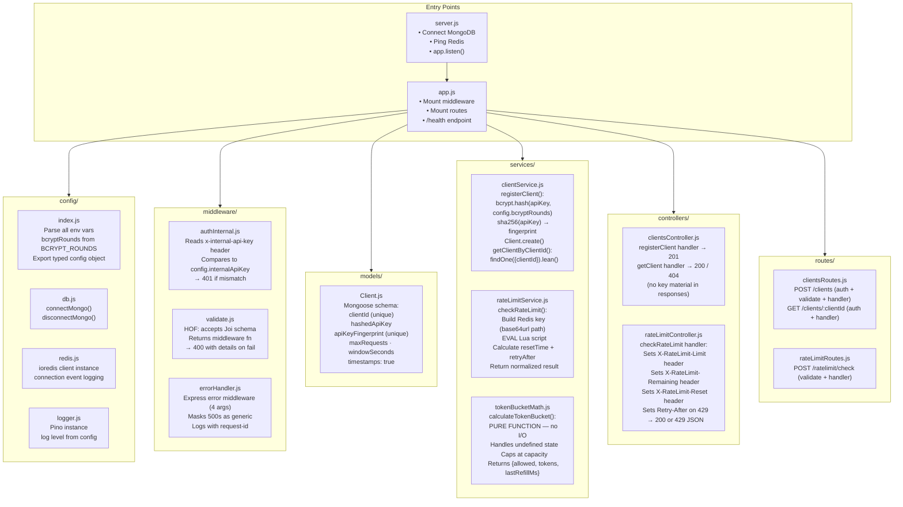

---

## 5. Why Token Bucket?

### Algorithm Comparison

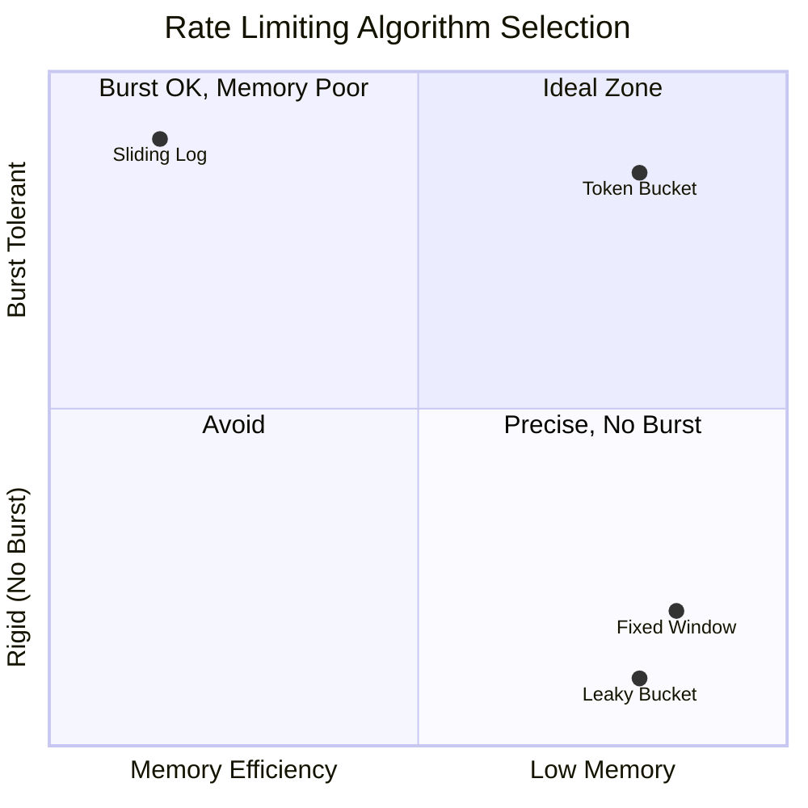

| Property | Token Bucket ✅ | Fixed Window | Sliding Log | Leaky Bucket |
|---|---|---|---|---|
| Burst handling | ✅ Up to capacity | ❌ Boundary bursts | ✅ Yes | ❌ Smoothed only |
| Memory per client | ✅ O(1) — 2 fields | ✅ O(1) | ❌ O(n) — timestamp log | ✅ O(1) |
| Atomic Redis update | ✅ HMSET | ⚠️ INCR + expiry | ❌ ZADD + ZRANGE | ✅ HMSET |
| Race-condition safe | ✅ via Lua EVAL | ⚠️ Needs WATCH | ✅ via Lua | ✅ via Lua |
| Real-world feel | ✅ Natural | ⚠️ Reset spikes | ✅ Smooth | ⚠️ Rigid |
| Implementation complexity | Low | Very Low | High | Low |

**Token Bucket was chosen** because:
1. Allows controlled bursting — real API clients send traffic in bursts, not at perfectly even intervals
2. Stores exactly **two fields per Redis key** — maximally memory-efficient
3. Integrates naturally with Redis atomic Lua — single EVAL call covers refill + consume

### Mathematical Definition

```
Given:
  C    = capacity (maxRequests)
  W    = windowSeconds
  r    = C / W              refill rate (tokens/second)
  rMs  = r / 1000           refill rate (tokens/millisecond)

On each check request:
  Δt       = now_ms − lastRefill_ms          elapsed time
  refilled = Δt × rMs                        tokens earned
  tokens   = min(C, tokens_prev + refilled)  cap at capacity
  allowed  = tokens ≥ 1

  if allowed:
    tokens = tokens − 1

State stored: { tokens, lastRefill = now_ms }
TTL:          windowSeconds × 2000 ms
```

---

## 6. Lua Script — Atomic Rate Decision

The entire **read → refill → consume → write** cycle executes inside a single `redis.call('EVAL', ...)`, making it safe under any level of concurrency without locks:

```lua
local key         = KEYS[1]
local now         = tonumber(ARGV[1])   -- current time (epoch ms)
local capacity    = tonumber(ARGV[2])   -- maxRequests
local refillPerMs = tonumber(ARGV[3])   -- tokens per millisecond
local requested   = tonumber(ARGV[4])   -- always 1
local ttlMs       = tonumber(ARGV[5])   -- windowSeconds × 2000

-- 1. Load current state (or use defaults for new buckets)
local data       = redis.call('HMGET', key, 'tokens', 'lastRefill')
local tokens     = tonumber(data[1]) or capacity
local lastRefill = tonumber(data[2]) or now

-- 2. Refill based on elapsed time
if now > lastRefill then
  local delta  = now - lastRefill
  local refill = delta * refillPerMs
  tokens       = math.min(capacity, tokens + refill)
  lastRefill   = now
end

-- 3. Consume or deny
local allowed = 0
if tokens >= requested then
  tokens  = tokens - requested
  allowed = 1
end

-- 4. Persist new state + refresh TTL
redis.call('HMSET', key, 'tokens', tokens, 'lastRefill', lastRefill)
redis.call('PEXPIRE', key, ttlMs)

return { allowed, tokens, lastRefill }
```

**Redis key structure:**
```
ratelimit:{clientId}:{base64url(path)}

Example:
  clientId: "acme-payments"
  path:     "/v1/orders"
  key:      "ratelimit:acme-payments:L3YxL29yZGVycw"
```

---

## 7. Request Lifecycle Diagrams

### 7.1 Rate Limit Check (with X-RateLimit-* Headers)

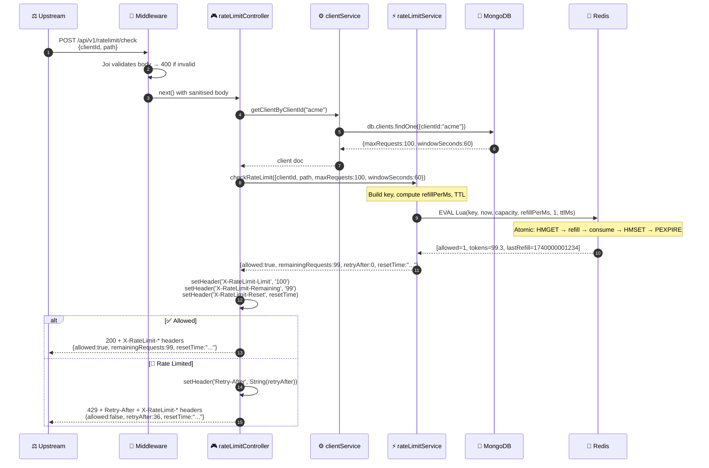

### 7.2 Client Registration

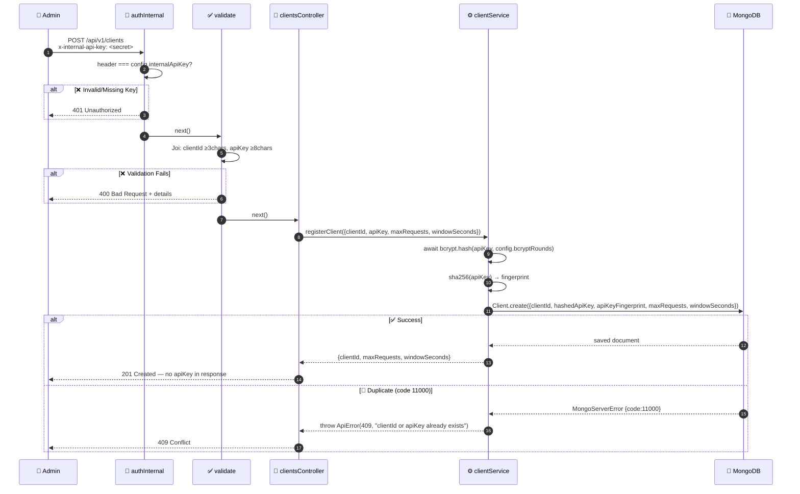

### 7.3 Get Client Config

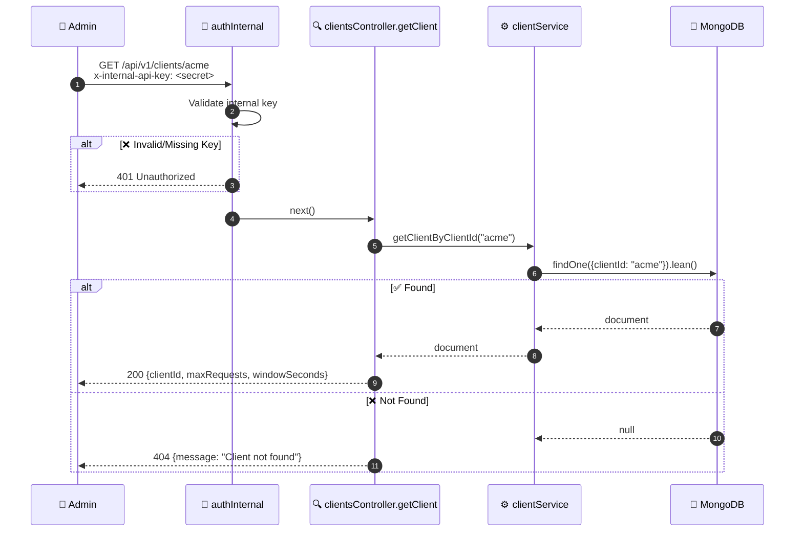

### 7.4 Health Check

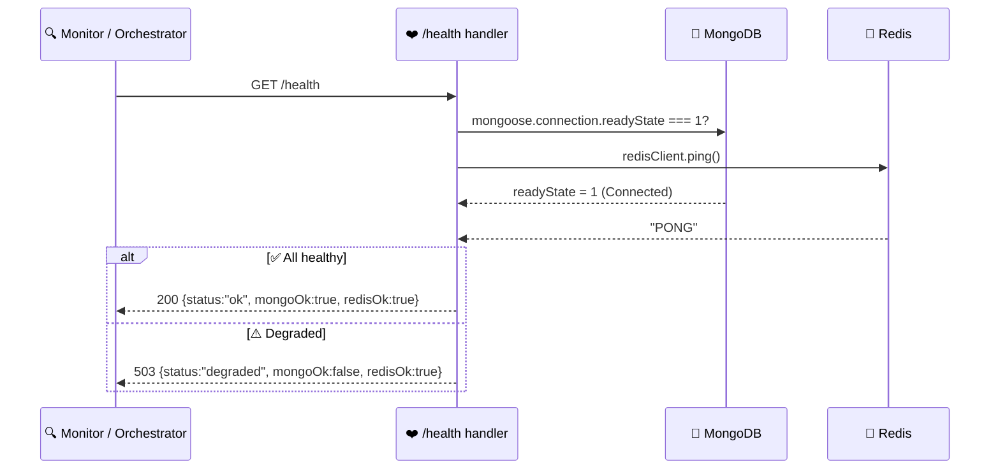

---

## 8. Data Design

### 8.1 MongoDB — `clients` Collection

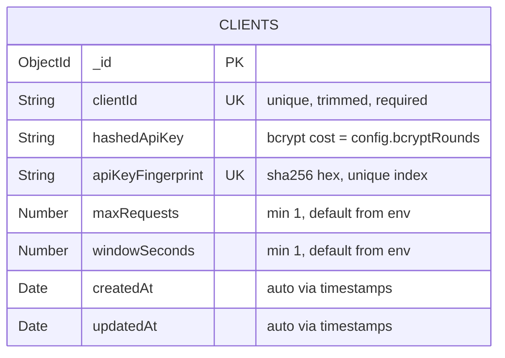

**Index Strategy:**
```
db.clients.createIndex({ clientId: 1 }, { unique: true })          // O(log n) lookup
db.clients.createIndex({ apiKeyFingerprint: 1 }, { unique: true }) // Enforce key uniqueness
```

**Why two API key fields?**
- `hashedApiKey` (bcrypt) — for future authentication/verification flows
- `apiKeyFingerprint` (SHA-256) — fast deterministic uniqueness check without bcrypt compare

### 8.2 Redis — Token Bucket State

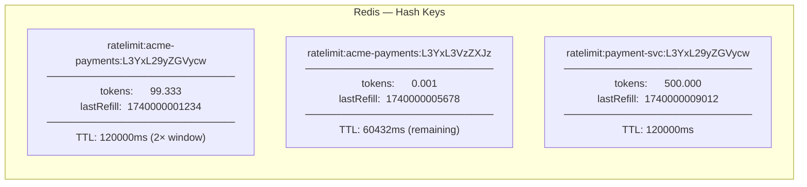

| Field | Type | Description |
|---|---|---|
| Key | String | `ratelimit:{clientId}:{base64url(path)}` |
| `tokens` | Float | Remaining token count (fractional precision) |
| `lastRefill` | Integer | Epoch milliseconds of last state computation |
| TTL | ms | `windowSeconds × 2000` — auto-expires idle buckets |

---

## 9. API Design Decisions

| Decision | Choice | Rationale |
|---|---|---|
| `/check` is a POST, not GET | POST | Carries a request body; GET with body is non-standard |
| `retryAfter` in seconds | Integer | RFC 7231 §7.1.3 specifies `Retry-After` header as integer seconds |
| `resetTime` as ISO 8601 | String | Machine-parseable, timezone-explicit, universally understood |
| Standard `X-RateLimit-*` headers | All responses | Industry standard (GitHub, Twitter API, RFC 6585 draft) — clients expect them |
| apiKey not in any response | Omitted | Security: the key should never be echoed back |
| 404 for unknown client | Not 400 | The clientId format is valid; the resource simply doesn't exist |
| GET /clients/:clientId | New endpoint | Inspection/debugging without DB access; returns no key material |
| `x-internal-api-key` header | Custom header | Keeps auth simple; no bearer/OAuth complexity for internal calls |
| Prefix `/api/v1/` | Versioned | Allows future `/api/v2/` without breaking existing callers |
| `BCRYPT_ROUNDS` configurable | env var | Allows fast hashing in test env (rounds=4) vs secure prod (rounds=12+) |

---

## 10. Security Architecture

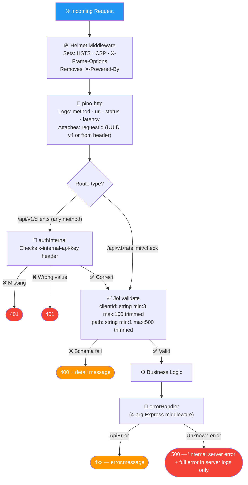

### Security Controls Summary

| Threat Vector | Control | Implementation |
|---|---|---|
| API key exposure | Irreversible hashing | bcrypt (`config.bcryptRounds`, default 12) via `bcryptjs` |
| Duplicate API key bypass | Uniqueness fingerprint | SHA-256 → unique MongoDB index |
| Unauthorized client management | Header gate | `x-internal-api-key` middleware on all `/clients` routes |
| Concurrent race conditions | Atomic operations | Redis Lua `EVAL` — single operation |
| Error information leakage | Response masking | 500s return generic string only |
| HTTP header attacks | Security headers | `helmet` middleware |
| Credential hardcoding | Environment variables | All secrets via `process.env`; documented in `.env.example` |
| Body-size attacks | Express default limit | 100kb JSON body limit (Express default) |

---

## 11. CI/CD Architecture

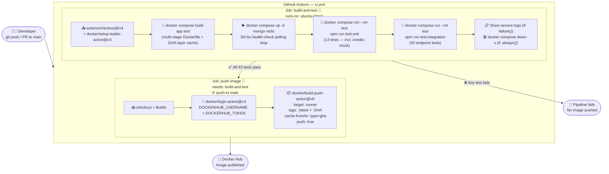

**Trigger matrix:**

| Event | `build-and-test` | `push-image` |
|---|---|---|
| Push to `main` | ✅ | ✅ (if secrets set) |
| Pull request to `main` | ✅ | ❌ |
| Push to other branch | ❌ | ❌ |

---

## 12. Dockerfile Architecture

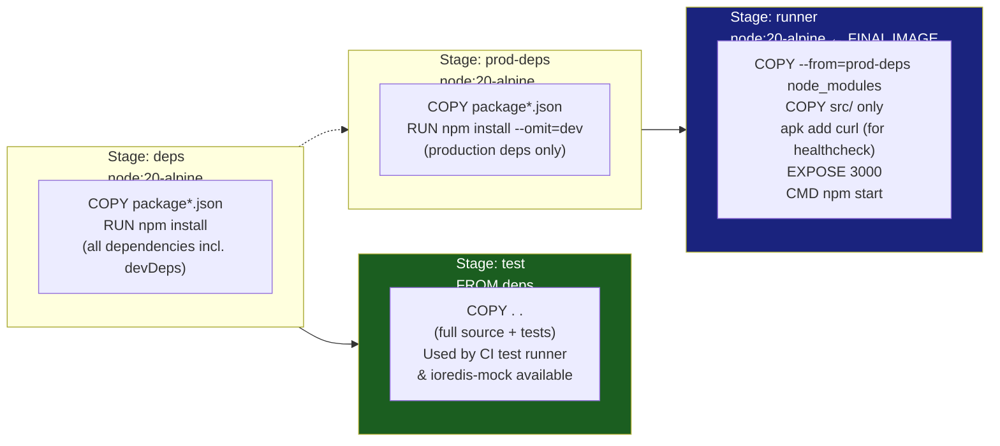

| Stage | Base Image | Contents | Used For |
|---|---|---|---|
| `deps` | `node:20-alpine` | All npm packages (dev + prod) | Shared layer cache |
| `test` | inherits `deps` | Full source + tests + ioredis-mock | CI `docker compose run test` |
| `prod-deps` | `node:20-alpine` | Only prod npm packages | Production layer isolation |
| `runner` | `node:20-alpine` | prod deps + `src/` only | Final pushed image (~80MB) |

**.dockerignore** ensures the build context is lean by excluding:
```
node_modules / .git / .env* / tests/ / *.md / *.log / coverage/
```

---

## 13. Scalability & Reliability

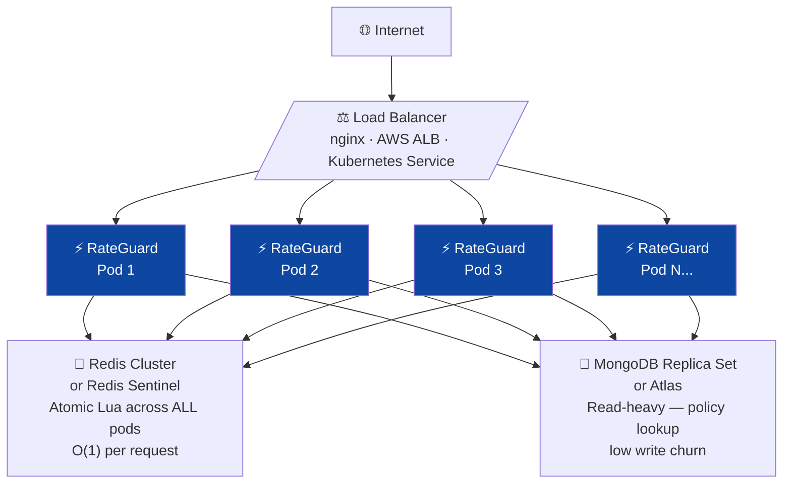

**Why horizontal scaling works:**
1. **No in-process state** — app pods carry zero rate-limit memory
2. **Redis Lua atomicity** — regardless of which pod processes a request, the Lua script executes atomically on the Redis primary
3. **Consistent policy reads** — MongoDB is read-only in the hot path (policy lookup); writes only happen on client registration
4. **Stateless health checks** — `/health` endpoint checks external dependencies, not local state

**Redis complexity:**

| Operation | Redis Command | Time Complexity |
|---|---|---|
| Read + write bucket state | `HMGET` + `HMSET` | O(1) |
| Set TTL | `PEXPIRE` | O(1) |
| Total per check request | `EVAL` (single roundtrip) | O(1) |

---

## 14. Observability Architecture

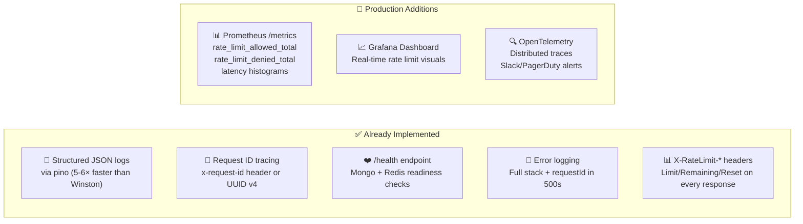

Current log format (pino structured JSON):
```json
{
  "level": "info",
  "time": "2026-03-04T08:01:41.000Z",
  "requestId": "a1b2c3d4-...",
  "req": { "method": "POST", "url": "/api/v1/ratelimit/check" },
  "res": { "statusCode": 429 },
  "responseTime": 4
}
```

---

## 15. Pros, Cons & Trade-offs

### ✅ Advantages

| Advantage | Detail |
|---|---|
| **Distributed correctness** | Redis Lua atomicity prevents over-counting under any concurrency |
| **Horizontal scalability** | Stateless pods + shared Redis state = infinite horizontal scale |
| **Burst tolerance** | Token Bucket naturally handles bursty real-world API traffic |
| **Separation of concerns** | Policy (Mongo) vs. state (Redis) vs. logic (Node.js) clearly separated |
| **Testability** | `tokenBucketMath.js` is I/O-free; `rateLimitService` unit-tested via `ioredis-mock` |
| **Standard headers** | `X-RateLimit-Limit/Remaining/Reset` on every response — clients don't need custom parsing |
| **One-command setup** | `docker compose up --build` starts everything with seeded test data |
| **Minimal Redis memory** | Only 2 fields (tokens + lastRefill) per clientId+path combination |
| **Auto-expiry** | Redis TTL auto-cleans idle bucket keys without manual cleanup |
| **Configurable security** | `BCRYPT_ROUNDS` env var allows fast test hashing and secure prod hashing |

### ⚠️ Trade-offs

| Trade-off | Mitigation |
|---|---|
| Requires Redis alongside app | Use Redis Sentinel / Cluster for HA; acceptable operational overhead |
| Redis unavailability blocks decisions | Implement circuit breaker (fail-open or fail-closed based on policy) |
| Internal API key is pre-shared secret | Replace with mTLS or signed JWT in production |
| No built-in metrics endpoint | Add Prometheus instrumentation for production observability |
| MongoDB adds latency per check request | Cache hot client policies in Redis (e.g., 30s TTL) for ultra-low latency |
| No UPDATE endpoint for client config | Add `PUT /api/v1/clients/:clientId` in Phase 2 |

---

## 16. Production Recommendations

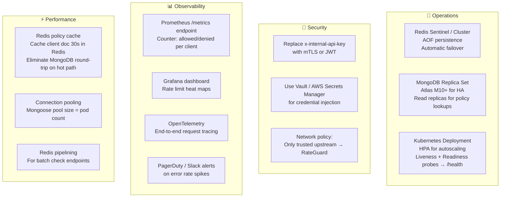

| Area | Recommendation |
|---|---|
| **Redis HA** | Redis Sentinel (3 nodes) or Redis Cluster with AOF persistence |
| **MongoDB HA** | Replica set (1 primary + 2 secondaries) or MongoDB Atlas |
| **Auth upgrade** | Replace pre-shared key with mTLS between gateway and RateGuard |
| **Observability** | Add `/metrics` with Prometheus counters for allowed/denied by clientId |
| **Performance** | Cache client documents in Redis (30s TTL) to eliminate MongoDB reads on hot paths |
| **Kubernetes** | Deploy with HPA (scale on CPU/RPS), liveness probe → `/health`, readiness probe → `/health` |
| **Secrets** | Use HashiCorp Vault, AWS Secrets Manager, or Kubernetes Secrets |
| **Tracing** | Instrument with OpenTelemetry SDK for distributed request traces |
| **bcrypt rounds** | Set `BCRYPT_ROUNDS=12` in prod (default), `BCRYPT_ROUNDS=4` in dev/test |
