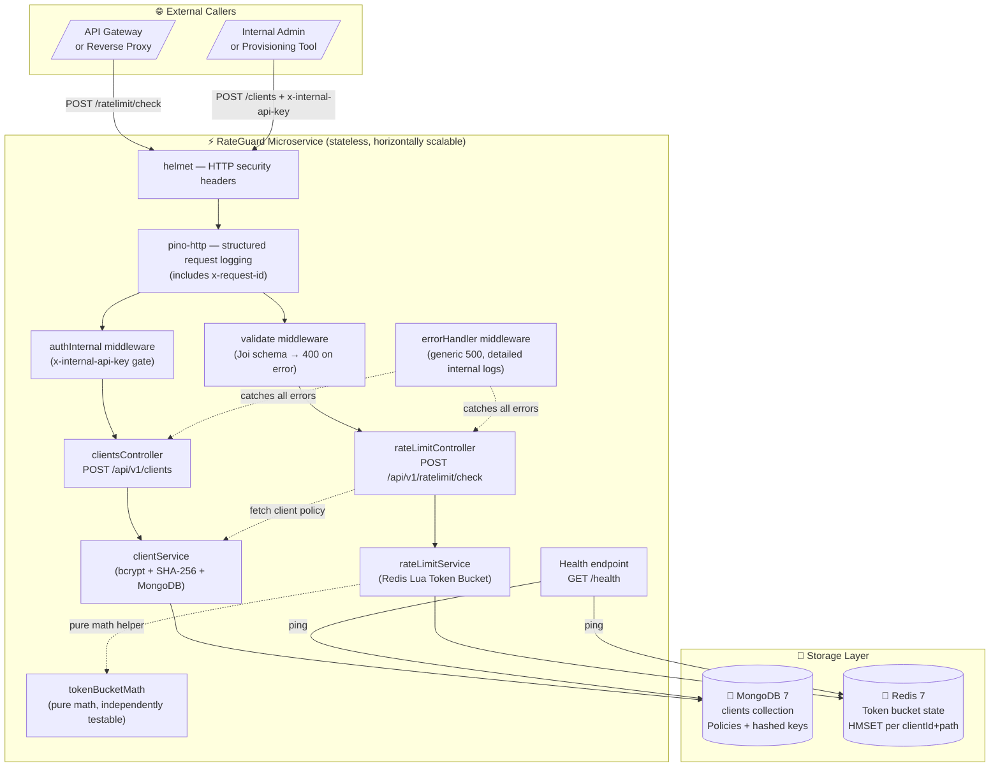
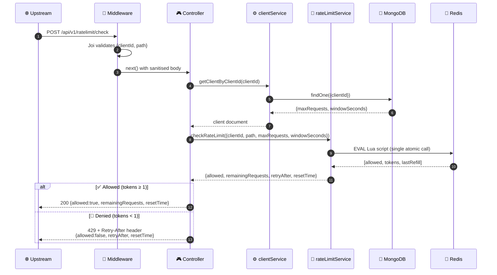
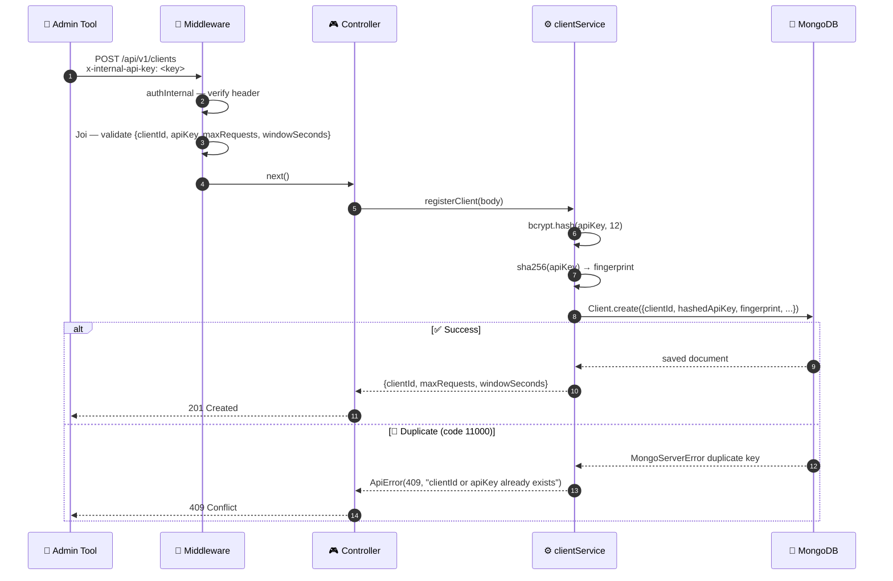
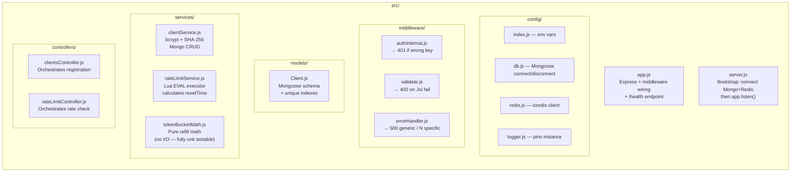
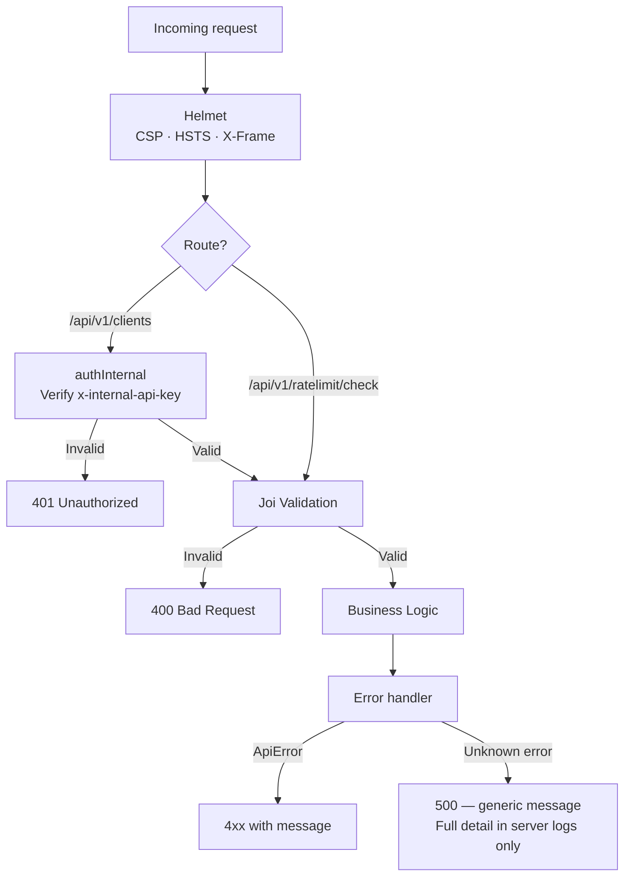
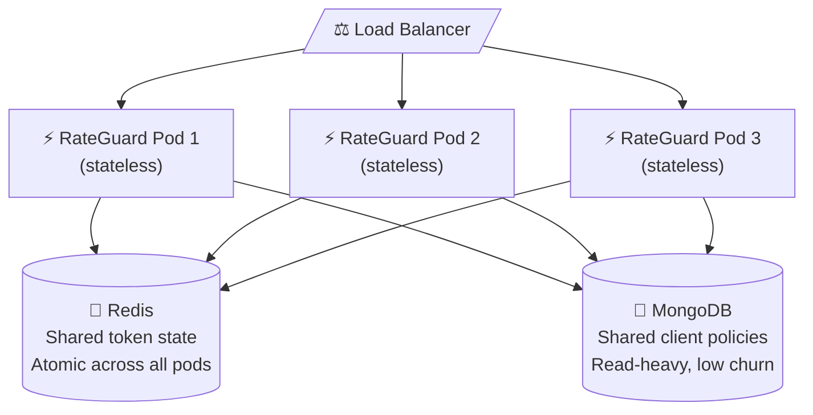
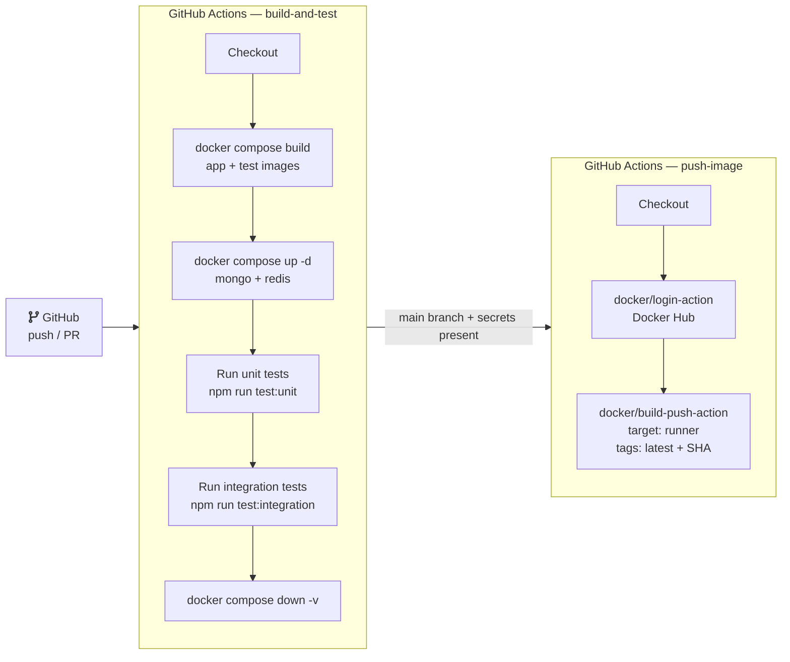

# 🏗️ ARCHITECTURE — RateGuard Rate Limiting Microservice

## 1. Objective and Core Idea

RateGuard is a **dedicated, stateless microservice** that enforces per-client, per-endpoint API rate limits across a distributed system. It removes rate-limiting logic from individual application services and centralises it in one reliable, horizontally-scalable layer.

**Key design goals:**
- Accurate distributed rate limiting with zero race conditions
- Per-client policy management independent of the service being protected
- One-command local setup for development and testing
- Production-grade containerisation and CI/CD automation

---

## 2. High-Level Architecture



---

## 3. Layered Architecture

| Layer | Technology | Responsibility |
|---|---|---|
| **HTTP / Transport** | Express 4, Helmet | Route registration, HTTP security headers |
| **Middleware** | Joi, pino-http, custom | Input validation, structured logging, auth guard, error normalisation |
| **Controllers** | Express handlers | Use-case orchestration, HTTP response shaping |
| **Services** | bcrypt, ioredis, Lua | Business logic: client registration, rate-limit evaluation |
| **Data (Config)** | MongoDB 7, Mongoose | Persistent client policy storage |
| **Data (State)** | Redis 7, ioredis | Ephemeral token-bucket state (in-memory, atomic) |
| **Containers** | Docker, Compose | Reproducible multi-service environments |
| **CI/CD** | GitHub Actions | Automated build, test, image publish |

---

## 4. Why Token Bucket?

### Comparison of algorithms

| Property | Token Bucket | Fixed Window | Sliding Log | Leaky Bucket |
|---|---|---|---|---|
| Burst handling | ✅ Yes (up to capacity) | ❌ Boundary bursts | ✅ Yes | ❌ Smoothed only |
| Memory per client | ✅ O(1) | ✅ O(1) | ❌ O(n) | ✅ O(1) |
| Atomic Redis update | ✅ HMSET | ✅ INCR | ❌ ZADD + range | ✅ HMSET |
| Distributed safe | ✅ via Lua | ⚠️ Race-prone | ✅ via Lua | ✅ via Lua |
| Real-world feel | ✅ Natural | ⚠️ Reset spikes | ✅ Smooth | ⚠️ Rigid |

**Token Bucket was chosen** because it allows controlled bursting (important for real-world API clients), stores minimal state (two fields per key), and integrates naturally with Redis atomic Lua execution.

### Mathematical definition

```
Given:
  C = capacity (maxRequests)
  W = windowSeconds
  r = C / W              refill rate (tokens/second)
  rMs = r / 1000         refill rate (tokens/millisecond)

On each request:
  elapsed  = now_ms − lastRefill_ms
  refilled = elapsed × rMs
  tokens   = min(C, tokens_prev + refilled)
  allowed  = tokens >= 1

  if allowed:
    tokens = tokens − 1

Store: { tokens, lastRefill = now_ms }
```

### Redis Lua implementation

The entire read-modify-write cycle executes in a single `redis.call('EVAL', ...)` — guaranteeing atomicity without `MULTI/EXEC` complexity:

```lua
local key      = KEYS[1]
local now      = tonumber(ARGV[1])   -- current epoch ms
local capacity = tonumber(ARGV[2])   -- maxRequests
local rateMs   = tonumber(ARGV[3])   -- tokens per ms
local ttlMs    = tonumber(ARGV[5])   -- key TTL (window × 2)

local data      = redis.call('HMGET', key, 'tokens', 'lastRefill')
local tokens    = tonumber(data[1]) or capacity
local lastRefill = tonumber(data[2]) or now

-- Refill
if now > lastRefill then
  tokens = math.min(capacity, tokens + (now - lastRefill) * rateMs)
  lastRefill = now
end

-- Consume
local allowed = 0
if tokens >= 1 then
  tokens = tokens - 1
  allowed = 1
end

redis.call('HMSET', key, 'tokens', tokens, 'lastRefill', lastRefill)
redis.call('PEXPIRE', key, ttlMs)

return { allowed, tokens, lastRefill }
```

Redis key pattern: `ratelimit:{clientId}:{base64url(path)}`  
TTL: `windowSeconds × 2` milliseconds (auto-expires idle bucket keys)

---

## 5. Request Lifecycle — Check Rate Limit



---

## 6. Request Lifecycle — Register Client



---

## 7. Data Design

### MongoDB — `clients` collection

| Field | Type | Constraint | Purpose |
|---|---|---|---|
| `_id` | ObjectId | Primary key | Mongo auto-generated |
| `clientId` | String | Unique index | Human-readable identifier |
| `hashedApiKey` | String | — | bcrypt hash (cost 12) |
| `apiKeyFingerprint` | String | Unique index | SHA-256 for uniqueness enforcement |
| `maxRequests` | Number | ≥ 1 | Bucket capacity |
| `windowSeconds` | Number | ≥ 1 | Refill window duration |
| `createdAt` | Date | — | Mongo timestamps |
| `updatedAt` | Date | — | Mongo timestamps |

### Redis — token bucket state

```
Key:    ratelimit:{clientId}:{base64url(path)}
Type:   Hash
Fields:
  tokens     Float   remaining token count
  lastRefill Int     epoch milliseconds of last state write

TTL:    windowSeconds × 2000 ms (auto-expired when idle)
```

---

## 8. Module Responsibilities



---

## 9. Security Architecture



| Threat | Mitigation |
|---|---|
| Plaintext API key storage | bcrypt (cost 12) — irreversible hash |
| Duplicate API keys | SHA-256 fingerprint with unique Mongo index |
| Unauthorized client creation | `x-internal-api-key` header gate |
| Race conditions in rate logic | Atomic Redis Lua `EVAL` |
| Error information leakage | 500 returns generic string; detail only logged server-side |
| HTTP header vulnerabilities | `helmet` middleware |
| Sensitive config in code | All secrets via environment variables |

---

## 10. Scalability & Reliability Architecture



**Why this works:**
- App nodes are completely stateless — no in-process rate-limit state
- All rate decisions go through Redis Lua atomically, regardless of which pod handles the request
- MongoDB is read-heavy (policy lookup per request) — well-suited for replica sets / Atlas

---

## 11. CI/CD Architecture



### Dockerfile stages

| Stage | Base | Purpose |
|---|---|---|
| `deps` | `node:20-alpine` | Install all dependencies (dev + prod) |
| `test` | inherits `deps` | Copy full source — used by CI `docker compose run test` |
| `prod-deps` | `node:20-alpine` | Install production-only dependencies |
| `runner` | `node:20-alpine` | Copy prod deps + `src/` only — minimal final image |

---

## 12. Pros, Cons & Trade-offs

### Advantages
- **Distributed correctness** — Redis Lua atomicity prevents over-counting under concurrency
- **Horizontal scalability** — stateless pods, shared Redis state
- **Separation of concerns** — policy (Mongo) vs state (Redis) vs logic (Node.js)
- **Burst tolerance** — Token Bucket naturally handles bursty API clients
- **Testability** — `tokenBucketMath.js` is pure I/O-free and unit tested in isolation
- **One-command setup** — `docker compose up --build` starts everything with test data seeded

### Trade-offs
- **Operational complexity** — requires MongoDB + Redis alongside the service
- **Redis availability** — if Redis is unavailable, the decision path fails (mitigated by Redis HA/Sentinel in production)
- **Internal API key auth** — minimal; production environments should use mTLS or JWT
- **No built-in dashboard** — rate limit metrics require external tooling (Prometheus, Grafana)

---

## 13. Production Recommendations

| Area | Recommendation |
|---|---|
| Redis HA | Deploy Redis Sentinel or Redis Cluster with AOF persistence |
| MongoDB | Use a replica set or Atlas M10+ for HA |
| Auth | Replace internal API key with mTLS or signed JWTs |
| Observability | Add Prometheus `/metrics` endpoint + Grafana dashboard |
| Tracing | Instrument with OpenTelemetry for distributed traces |
| Deployment | Provide Kubernetes manifests with HPA for autoscaling |
| Secrets | Use Vault, AWS Secrets Manager, or Kubernetes Secrets — never hardcode |
