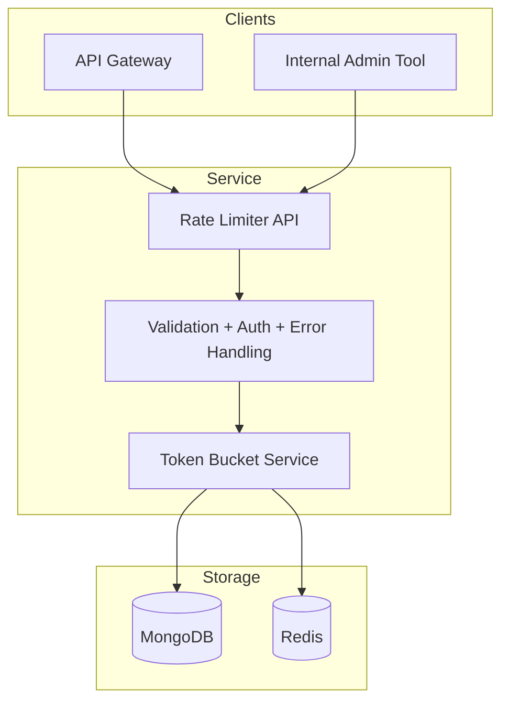
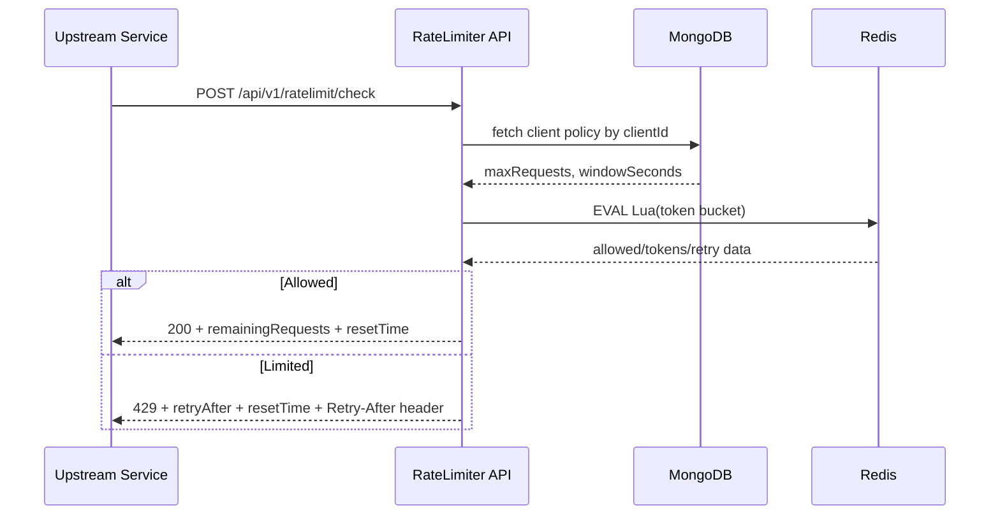
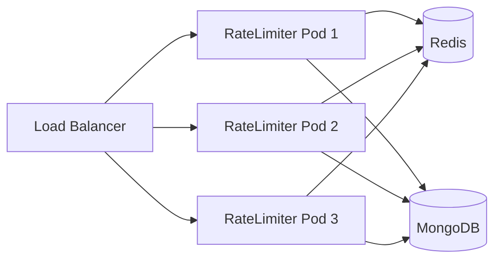
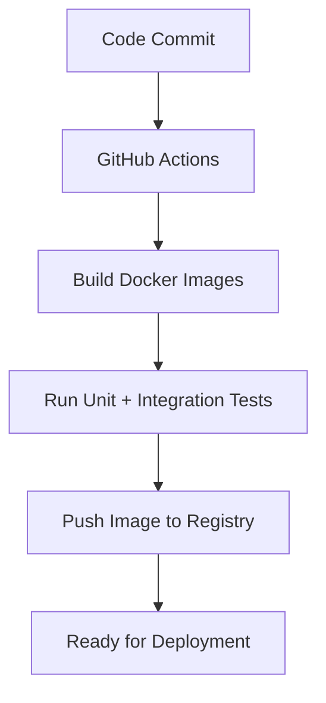

# Architecture Documentation

## 1. Objective and Core Idea

The objective of this system is to provide a dedicated **Rate Limiting Microservice** that can be called by API gateways or upstream services to decide whether a request should be allowed.

The service enforces limits based on **clientId + path** and is designed for distributed environments where multiple service instances may run concurrently.

## 2. High-Level Design

The architecture separates concerns clearly:

- **Application layer (stateless):** Express API logic, validation, auth checks, response formatting.
- **Configuration layer (persistent):** MongoDB stores client plans and policy values.
- **Rate state layer (volatile/distributed):** Redis stores token-bucket state and performs atomic updates.

This design ensures consistency, scalability, and fault isolation.

## 3. Why Token Bucket

### Chosen algorithm: Token Bucket

**Reasoning:**
- Supports short bursts while controlling long-term rate.
- Fits real-world API traffic with periodic bursts.
- Efficient to compute with floating-point token refill.
- Compatible with atomic Redis Lua updates across multiple instances.

### Formula used

Let:

- $C$ = bucket capacity (`maxRequests`)
- $W$ = window seconds (`windowSeconds`)
- $r = C/W$ = refill tokens per second
- $\Delta t$ = elapsed seconds since last refill

Then:

$$
tokens_{new} = \min(C, tokens_{old} + r \cdot \Delta t)
$$

A request is allowed if $tokens_{new} \ge 1$.

## 4. Request Execution Workflow

## 5. Data Design

### MongoDB: clients collection

- `clientId` (unique)
- `hashedApiKey` (bcrypt hash)
- `apiKeyFingerprint` (SHA-256 unique fingerprint)
- `maxRequests`
- `windowSeconds`
- `createdAt`, `updatedAt`

### Redis: token bucket state

Key pattern:

`ratelimit:{clientId}:{base64url(path)}`

Fields:
- `tokens`
- `lastRefill`

## 6. Key Modules and Responsibilities

- `src/controllers/*`
  - Parse and route business behavior from validated requests.
- `src/services/clientService.js`
  - Client registration, hashing, uniqueness enforcement.
- `src/services/rateLimitService.js`
  - Token bucket atomic calculation through Redis Lua script.
- `src/middleware/validate.js`
  - Input validation and uniform `400` handling.
- `src/middleware/errorHandler.js`
  - Consistent error response and structured server logging.
- `src/config/*`
  - Runtime config, logger setup, Mongo/Redis connections.

## 7. Security Model

- `POST /api/v1/clients` protected by `x-internal-api-key`.
- API keys are never stored in plaintext.
- Detailed errors are logged internally while generic `500` is returned externally.

## 8. Pros and Cons

### Advantages
- Horizontally scalable service behavior.
- Correct concurrency behavior via Lua atomicity.
- Fast decisioning using Redis in-memory operations.
- Clean separation of policy storage vs runtime state.

### Trade-offs
- Additional operational complexity (Mongo + Redis).
- External cache dependency for decision path.
- Requires robust monitoring for Redis availability/latency.

## 9. Integration Details

### Integrations
- Upstream gateway/service calls check endpoint.
- Internal provisioning system creates clients.
- CI pipeline builds, tests, and publishes container images.

### Deployment context
- Designed for containerized environments (Docker/Kubernetes).
- Supports multi-instance app replicas with shared Redis/Mongo.

## 10. Scalability and Reliability Strategy

- Stateless app nodes can scale horizontally.
- Shared Redis preserves consistent rate decisions.
- Mongo centralizes client policy management.

## 11. Operational Workflow

This architecture supports reliable, traceable, and production-oriented operation for distributed API ecosystems.
