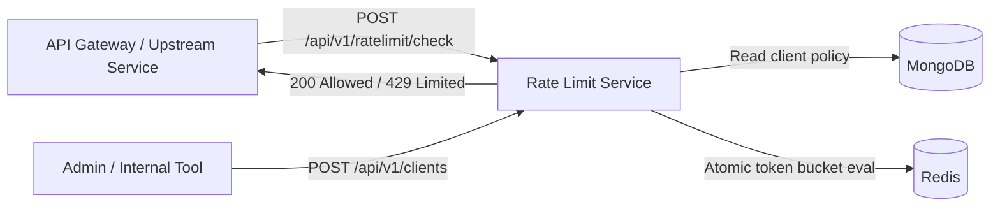
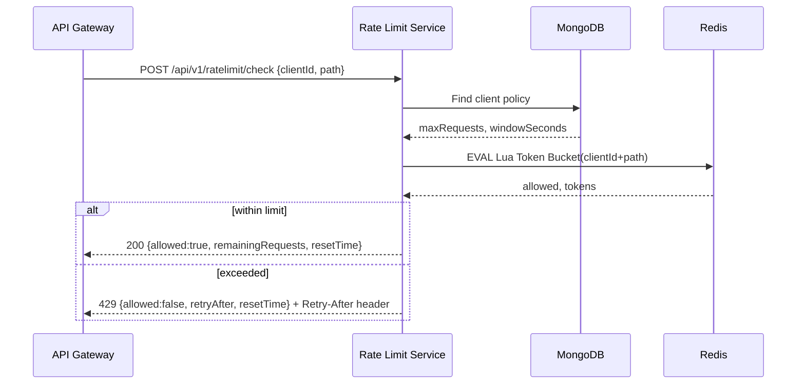
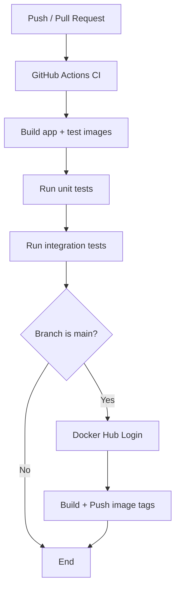

# 🚀 Scalable API Rate Limiting Microservice

<div align="center">

**Production-ready, distributed Token Bucket rate limiter** for modern microservice ecosystems.

Node.js • Express • MongoDB • Redis • Docker • GitHub Actions

</div>

---

## ✨ Project Overview

This project provides a dedicated microservice that enforces per-client, per-endpoint API limits using a **distributed Token Bucket algorithm** backed by **Redis atomic Lua scripts**.

It is designed for environments where services must stay resilient under traffic spikes, abuse, and bursty workloads while remaining horizontally scalable.

**Primary goals:**
- Protect downstream APIs from overload.
- Ensure fair usage across clients.
- Keep logic stateless at app layer and distributed via external stores.
- Deliver one-command local setup and CI/CD readiness.

---

## 🧰 Tech Stack

| Layer | Technology | Why Chosen |
|---|---|---|
| Runtime | Node.js 20 | Fast I/O, mature ecosystem, ideal for API microservices |
| Web Framework | Express | Lightweight, explicit routing and middleware control |
| Client Config Store | MongoDB | Flexible schema + fast unique index support |
| Rate State Store | Redis | High-throughput in-memory store with Lua atomicity |
| Security | bcrypt + SHA-256 fingerprint | Safe API key storage + uniqueness checks |
| Logging | Pino + pino-http | Structured logs with request IDs |
| Testing | Jest + Supertest | Fast unit + endpoint integration validation |
| Containers | Docker + Compose | Reproducible environments and one-command startup |
| CI/CD | GitHub Actions | Automated build, test, and image publishing |

---

## 🗂️ Code Structure

```text
my-ratelimit-service/
├── src/
│   ├── config/                 # env, logger, Mongo and Redis clients
│   ├── controllers/            # request handlers
│   ├── middleware/             # auth, validation, error handling
│   ├── models/                 # Mongo schemas (Client)
│   ├── routes/                 # route groups and API versioning
│   ├── services/               # business logic (client + token bucket)
│   ├── utils/                  # shared utility types (ApiError)
│   ├── app.js                  # app wiring, health endpoint
│   └── server.js               # bootstrapping and startup
├── tests/
│   ├── unit/                   # algorithm tests
│   └── integration/            # endpoint + flow tests
├── .github/workflows/ci.yml    # CI/CD automation
├── Dockerfile                  # multi-stage container build
├── docker-compose.yml          # app + mongo + redis orchestration
├── init-db.js                  # startup database seed data
├── .env.example                # environment template
├── API_DOCS.md                 # endpoint-level API docs
├── architecture.md             # architecture and design deep dive
└── projectdocumentation.md     # complete project documentation
```

---

## 🧠 System Architecture Diagram



---

## 🔁 Execution Flow Diagram



---

## ⚙️ Workflow (Build → Test → Release)



---

## 🐳 Local Setup & Installation

### Prerequisites
- Docker Desktop (with Compose v2)
- Git

### 1) Clone
```bash
git clone <your-repository-url>
cd my-ratelimit-service
```

### 2) Configure environment (optional overrides)
```bash
cp .env.example .env
```

### 3) Start full stack
```bash
docker compose up --build
```

### 4) Verify health
```bash
curl http://localhost:3000/health
```

Expected response:
```json
{"status":"ok","mongoOk":true,"redisOk":true}
```

---

## ▶️ Usage Instructions

### Register a client
```bash
curl -X POST http://localhost:3000/api/v1/clients \
  -H "Content-Type: application/json" \
  -H "x-internal-api-key: dev-internal-key" \
  -d '{"clientId":"client-a","apiKey":"my-strong-key-123","maxRequests":5,"windowSeconds":60}'
```

### Check rate limit
```bash
curl -X POST http://localhost:3000/api/v1/ratelimit/check \
  -H "Content-Type: application/json" \
  -d '{"clientId":"client-a","path":"/v1/orders"}'
```

Full API contract: [API_DOCS.md](API_DOCS.md)

---

## 🧪 Testing & Validation

### Run all tests
```bash
docker compose run --rm test npm run test:all
```

### Run individual suites
```bash
docker compose run --rm test npm run test:unit
docker compose run --rm test npm run test:integration
```

### Validation checklist
- Health endpoint returns `200`.
- Client registration returns `201` for new clients.
- Duplicate `clientId`/`apiKey` returns `409`.
- Limit exceeded returns `429` with `Retry-After` header.
- Invalid inputs return `400`.

---

## 🔐 Security & Reliability Highlights

- API keys are hashed with bcrypt before persistence.
- API key uniqueness enforced using SHA-256 fingerprint index.
- Atomic Redis Lua execution avoids race conditions under concurrency.
- Structured logs include request IDs for traceability.
- Stateless service design supports horizontal scaling.

---

## 📚 Additional Documentation

- Architecture deep dive: [architecture.md](architecture.md)
- Complete project documentation: [projectdocumentation.md](projectdocumentation.md)
- Endpoint documentation: [API_DOCS.md](API_DOCS.md)

---

## ✅ Production-Readiness Notes

This backend microservice is production-oriented and fully tested end-to-end. UI responsiveness requirements are not applicable here because this project intentionally has no frontend layer.
