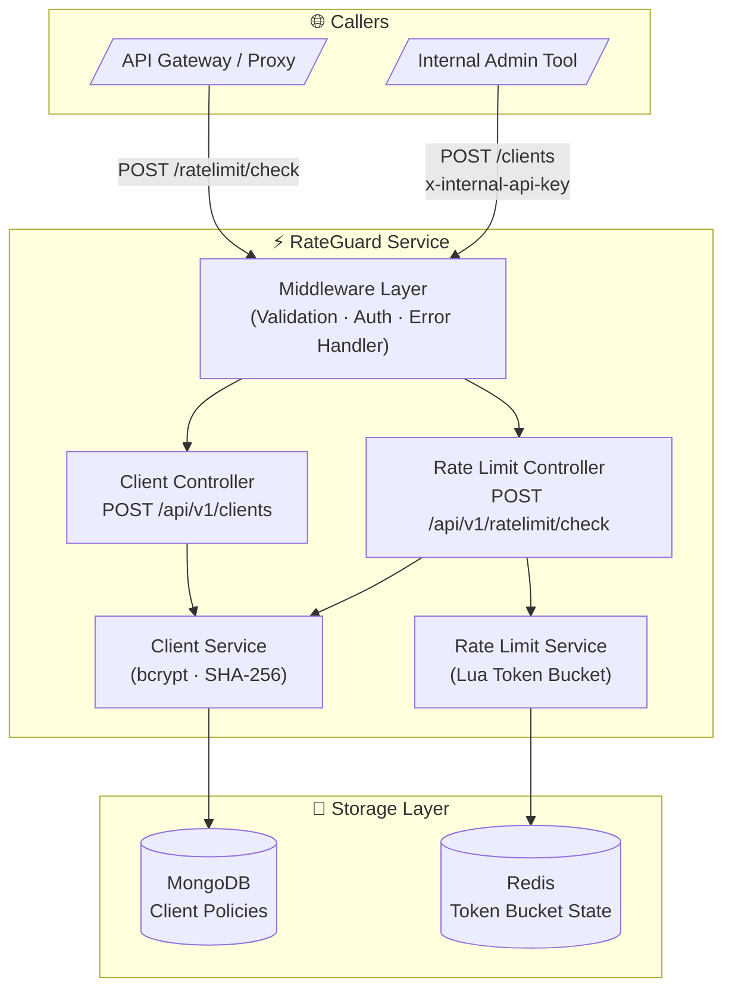
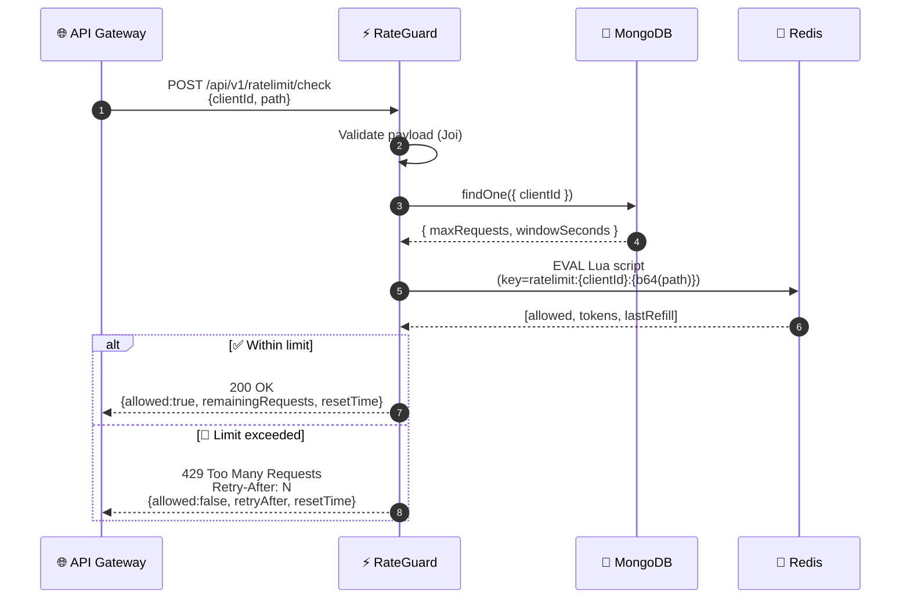
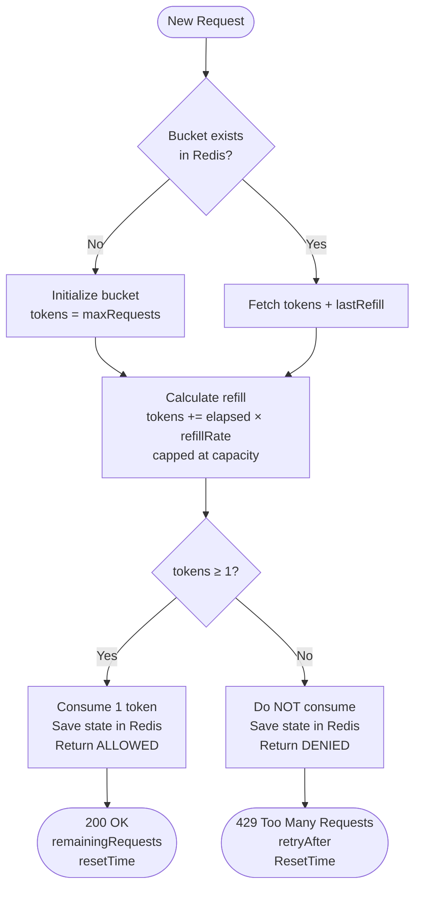
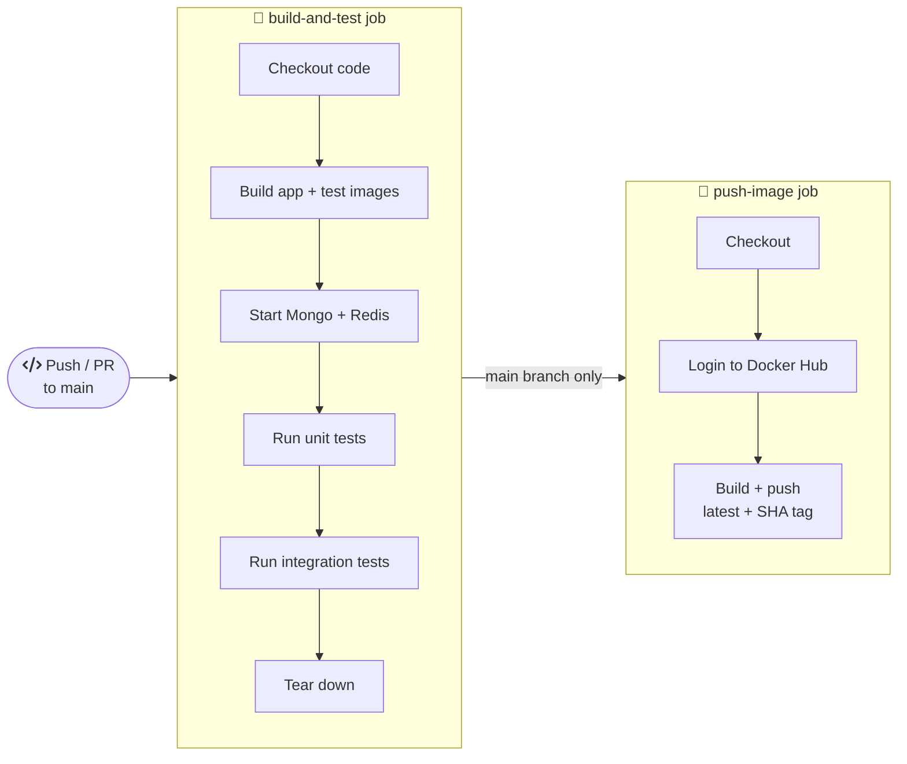

<div align="center">

# ⚡ RateGuard

### Scalable API Rate Limiting Microservice

[](https://github.com/features/actions)
[](https://www.docker.com/)
[](https://nodejs.org/)
[](https://redis.io/)
[](https://www.mongodb.com/)
[](LICENSE)

**Production-ready, distributed API rate limiting via the Token Bucket algorithm — backed by Redis atomic Lua scripts, secured by bcrypt, and delivered in a single `docker compose up`.**

[📖 API Docs](API_DOCS.md) · [🏗️ Architecture](ARCHITECTURE.md) · [📋 Full Documentation](projectdocumentation.md)

</div>

---

## 📌 Overview

**RateGuard** is a dedicated backend microservice that acts as a centralized rate-limit enforcement layer for any API ecosystem. Upstream services (e.g. API gateways, reverse proxies) call RateGuard before forwarding requests to check whether a client has exceeded its configured quota.

| Capability | Detail |
|---|---|
| Algorithm | **Token Bucket** — burst-friendly, continuously refilling |
| Distributed consistency | **Redis Lua** atomic scripts — no race conditions |
| Policy store | **MongoDB** — per-client `maxRequests` + `windowSeconds` |
| API key security | **bcrypt** hash + SHA-256 uniqueness fingerprint |
| Containerization | **Multi-stage Dockerfile** — minimal production image |
| CI/CD | **GitHub Actions** — build → unit test → integration test → Docker push |
| One-command setup | `docker compose up --build` |

---

## 🏗️ System Architecture



---

## 🔁 Request Execution Flow



---

## 🪣 Token Bucket Algorithm



**Formula:**
```
refillRate   = maxRequests / windowSeconds  (tokens per second)
tokensNew    = min(capacity, tokensOld + elapsed × refillRate)
allowed      = tokensNew >= 1
```

All state reads and writes execute inside a **single Redis `EVAL` Lua call** — atomically, with no risk of race conditions under horizontal scaling.

---

## ⚙️ CI/CD Pipeline



Secrets required in GitHub → Settings → Secrets:

| Secret | Purpose |
|---|---|
| `DOCKERHUB_USERNAME` | Docker Hub account |
| `DOCKERHUB_TOKEN` | Docker Hub access token |

---

## 🗂️ Project Structure

```
my-ratelimit-service/
├── src/
│   ├── app.js                  ← Express app wiring + /health endpoint
│   ├── server.js               ← Startup bootstrap (connects Mongo + Redis)
│   ├── config/
│   │   ├── index.js            ← All env vars parsed + exported
│   │   ├── db.js               ← MongoDB connection helpers
│   │   ├── redis.js            ← ioredis client + event logging
│   │   └── logger.js           ← Pino structured logger
│   ├── controllers/
│   │   ├── clientsController.js        ← Register client handler
│   │   └── rateLimitController.js      ← Check rate limit handler
│   ├── middleware/
│   │   ├── authInternal.js     ← x-internal-api-key guard
│   │   ├── validate.js         ← Joi schema validation (→ 400)
│   │   └── errorHandler.js     ← Centralised error formatter
│   ├── models/
│   │   └── Client.js           ← Mongoose schema with unique indexes
│   ├── routes/
│   │   ├── index.js            ← API router mount (/api/v1)
│   │   ├── clientsRoutes.js    ← POST /clients
│   │   └── rateLimitRoutes.js  ← POST /ratelimit/check
│   ├── services/
│   │   ├── clientService.js    ← bcrypt + SHA-256 + Mongo persistence
│   │   ├── rateLimitService.js ← Redis Lua token bucket executor
│   │   └── tokenBucketMath.js  ← Pure math (testable without Redis)
│   └── utils/
│       └── ApiError.js         ← Error class with HTTP status codes
├── tests/
│   ├── unit/
│   │   └── tokenBucketMath.test.js     ← 8 pure algorithm tests
│   └── integration/
│       ├── setupIntegration.js         ← DB connect/disconnect/flush
│       ├── clients.test.js             ← 9 endpoint tests
│       └── ratelimit.test.js           ← 10 endpoint tests
├── .github/workflows/ci.yml    ← GitHub Actions CI/CD definition
├── Dockerfile                  ← Multi-stage (deps → test → prod-deps → runner)
├── docker-compose.yml          ← app + test + mongo + redis orchestration
├── init-db.js                  ← MongoDB seed with 3 clients (idempotent upsert)
├── jest.config.js              ← Jest config (runInBand, 30s timeout)
├── package.json
├── .env.example                ← Environment variable template
├── API_DOCS.md                 ← Full endpoint reference
├── ARCHITECTURE.md             ← Architecture decisions and diagrams
└── projectdocumentation.md     ← Complete project documentation
```

---

## 🚀 Quick Start (Local)

### Prerequisites
- [Docker Desktop](https://www.docker.com/products/docker-desktop/) (with Compose v2)
- Git

### Step 1 — Clone

```bash
git clone <your-repository-url>
cd my-ratelimit-service
```

### Step 2 — Configure (optional)

```bash
cp .env.example .env
# Edit .env to override defaults if needed
```

### Step 3 — Launch the full stack

```bash
docker compose up --build
```

This single command:
1. Builds the multi-stage Docker image
2. Starts MongoDB (with 3 seeded test clients)
3. Starts Redis
4. Starts the RateGuard API on port `3000`

### Step 4 — Confirm it's running

```bash
curl http://localhost:3000/health
```

Expected:
```json
{ "status": "ok", "mongoOk": true, "redisOk": true }
```

---

## 📡 API Usage

### Register a new client

```bash
curl -X POST http://localhost:3000/api/v1/clients \
  -H "Content-Type: application/json" \
  -H "x-internal-api-key: dev-internal-key" \
  -d '{
    "clientId": "my-service",
    "apiKey":   "my-strong-api-key-123456",
    "maxRequests": 10,
    "windowSeconds": 60
  }'
```

Response `201 Created`:
```json
{ "clientId": "my-service", "maxRequests": 10, "windowSeconds": 60 }
```

---

### Check rate limit (allowed)

```bash
curl -X POST http://localhost:3000/api/v1/ratelimit/check \
  -H "Content-Type: application/json" \
  -d '{ "clientId": "my-service", "path": "/v1/orders" }'
```

Response `200 OK`:
```json
{
  "allowed": true,
  "remainingRequests": 9,
  "resetTime": "2026-03-02T09:01:12.345Z"
}
```

---

### After exhausting the limit

```bash
# Run 11 times for a client with maxRequests=10
for i in {1..11}; do
  curl -s -o /dev/null -w "%{http_code}\n" -X POST http://localhost:3000/api/v1/ratelimit/check \
    -H "Content-Type: application/json" \
    -d '{"clientId":"my-service","path":"/v1/orders"}'
done
```

The 11th call returns `429 Too Many Requests`:
```json
{
  "allowed": false,
  "retryAfter": 6,
  "resetTime": "2026-03-02T09:01:18.000Z"
}
```
With header: `Retry-After: 6`

---

### Pre-seeded test clients (available immediately on `docker compose up`)

| clientId | maxRequests | windowSeconds |
|---|---|---|
| `seed-client-basic` | 10 | 60 |
| `seed-client-pro` | 100 | 60 |
| `seed-client-burst` | 500 | 60 |

---

## 🧪 Testing

### Run all tests inside Docker

```bash
docker compose run --rm test npm run test:all
```

### Run individual suites

```bash
docker compose run --rm test npm run test:unit         # 8 pure algorithm tests
docker compose run --rm test npm run test:integration  # 19 endpoint tests
```

### Test results

```
PASS  tests/unit/tokenBucketMath.test.js       (8 tests)
PASS  tests/integration/clients.test.js        (9 tests)
PASS  tests/integration/ratelimit.test.js      (10 tests)

Test Suites: 3 passed, 3 total
Tests:       27 passed, 27 total
```

Tests run against **live MongoDB + Redis containers** inside Docker — no mocking, no external dependencies needed on the host.

---

## 🔐 Security Highlights

| Concern | Solution |
|---|---|
| API key storage | bcrypt (cost 12) — keys never stored in plaintext |
| API key uniqueness | SHA-256 fingerprint with unique MongoDB index |
| Client registration auth | `x-internal-api-key` header gate (configurable) |
| Race conditions | Atomic Redis Lua `EVAL` — single operation, no TOCTOU |
| Error leakage | Generic `"Internal server error"` for 500s; detail only in server logs |
| Helmet | HTTP security headers via `helmet` middleware |

---

## 🌍 Environment Variables

| Variable | Default | Description |
|---|---|---|
| `PORT` | `3000` | Service listening port |
| `MONGO_URI` | `mongodb://mongo:27017/ratelimitdb` | MongoDB connection |
| `REDIS_URL` | `redis://redis:6379` | Redis connection |
| `DEFAULT_RATE_LIMIT_MAX_REQUESTS` | `100` | Default bucket capacity |
| `DEFAULT_RATE_LIMIT_WINDOW_SECONDS` | `60` | Default window duration |
| `INTERNAL_API_KEY` | `dev-internal-key` | Header value for client registration |
| `LOG_LEVEL` | `info` | Pino log level |
| `NODE_ENV` | `development` | Runtime environment |

Copy `.env.example` → `.env` and override any values as needed.

---

## 📚 Documentation

| Document | Description |
|---|---|
| [API_DOCS.md](API_DOCS.md) | Full endpoint reference with request/response schemas, cURL examples, and error table |
| [ARCHITECTURE.md](ARCHITECTURE.md) | Architecture decisions, diagrams, module breakdown, data design, scalability strategy |
| [projectdocumentation.md](projectdocumentation.md) | Problem statement, goals, data flow, security model, testing strategy, production readiness |

---

<div align="center">

Built with ❤️ using Node.js, Redis, MongoDB, Docker, and GitHub Actions

</div>
