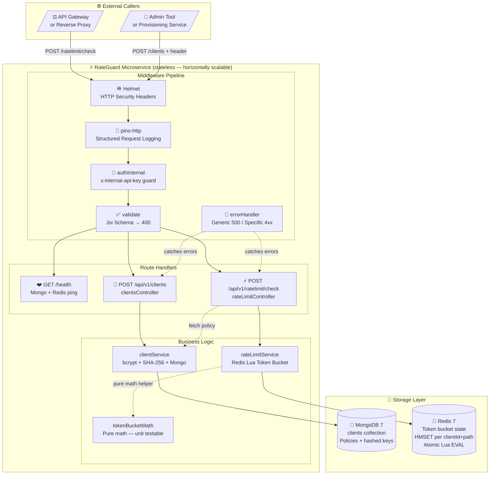
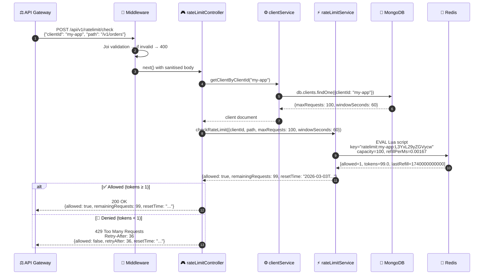
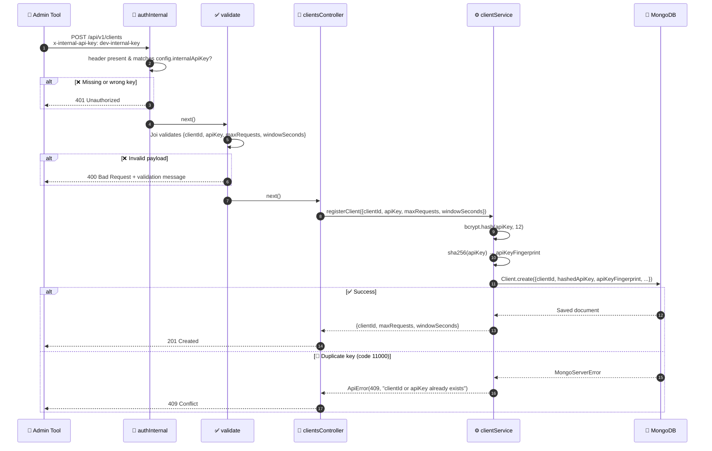
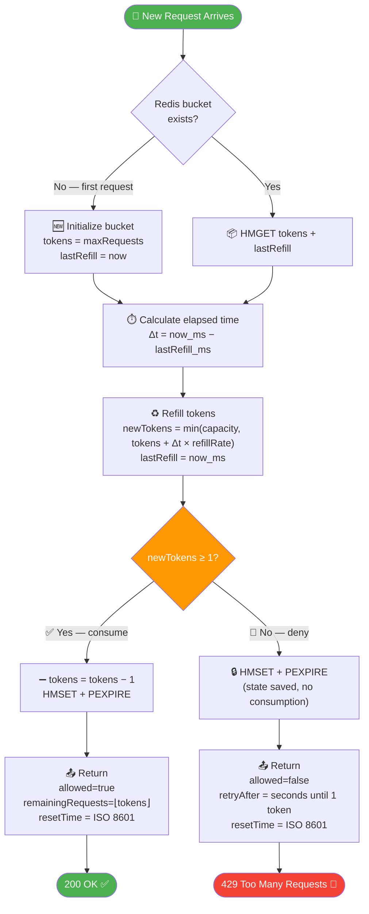
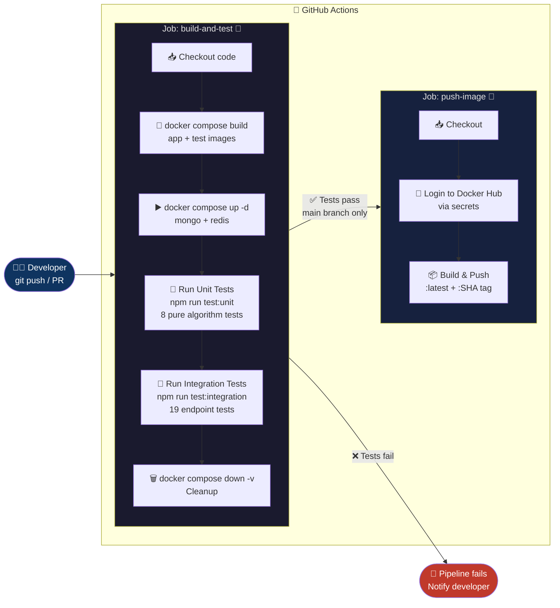
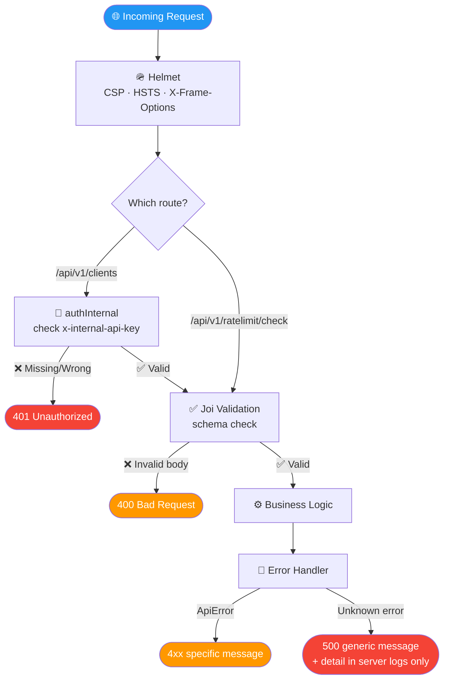
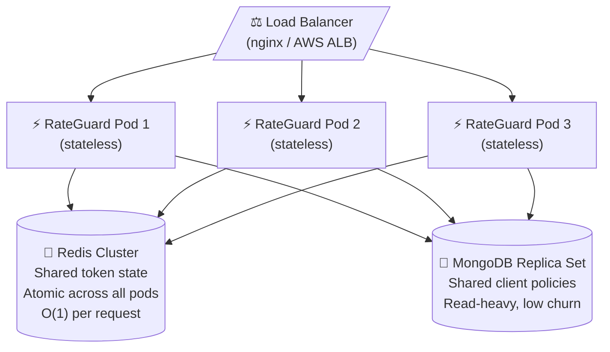

<div align="center">


# ⚡ RateGuard

### 🛡️ Production-Grade API Rate Limiting Microservice

[](https://github.com/ramalokeshreddyp/RateGuard/actions/workflows/ci.yml)
[](https://nodejs.org/)
[](https://redis.io/)
[](https://www.mongodb.com/)
[](https://www.docker.com/)
[](https://jestjs.io/)
[](LICENSE)

<br/>

> **RateGuard** is a dedicated, high-performance, stateless microservice that enforces per-client, per-endpoint API rate limits across any distributed system — powered by a Redis-atomic **Token Bucket** algorithm, secured by **bcrypt**, and shipped as a fully Dockerized, CI/CD-automated service.

<br/>

[📖 API Docs](API_DOCS.md) &nbsp;·&nbsp; [🏗️ Architecture](ARCHITECTURE.md) &nbsp;·&nbsp; [📋 Full Documentation](projectdocumentation.md) &nbsp;·&nbsp; [🐛 Issues](https://github.com/ramalokeshreddyp/RateGuard/issues)

</div>

---

## 📌 Table of Contents

- [🌟 Why RateGuard?](#-why-rateguard)
- [🔧 Tech Stack](#-tech-stack)
- [🏗️ System Architecture](#️-system-architecture)
- [🔁 Execution Flow](#-execution-flow)
- [🪣 Token Bucket Algorithm](#-token-bucket-algorithm)
- [⚙️ CI/CD Pipeline](#️-cicd-pipeline)
- [🗂️ Project Structure](#️-project-structure)
- [🚀 Quick Start](#-quick-start)
- [📡 API Reference](#-api-reference)
- [🧪 Testing](#-testing)
- [🌍 Environment Variables](#-environment-variables)
- [🔐 Security Model](#-security-model)
- [📈 Scalability](#-scalability)
- [📚 Documentation](#-documentation)

---

## 🌟 Why RateGuard?

In distributed microservice architectures, uncontrolled API traffic leads to:

| Problem | Impact |
|---|---|
| Runaway clients | Service degradation for all users |
| DDoS / abuse | Complete outages |
| Fair-usage violations | Revenue and SLA loss |
| In-process rate limits | Break under horizontal scaling |

**RateGuard solves all of these** with a centralized, stateless, horizontally scalable rate-limiting layer:

| Feature | Implementation |
|---|---|
| 🧮 Algorithm | **Token Bucket** — burst-friendly, continuously refilling |
| ⚛️ Distributed consistency | **Redis Lua** atomic scripts — zero race conditions at scale |
| 🗄️ Policy store | **MongoDB** — per-client `maxRequests` + `windowSeconds` |
| 🔑 API key security | **bcrypt** (cost 12) + SHA-256 uniqueness fingerprint |
| 🐳 Containerization | **Multi-stage Dockerfile** — minimal, secure production image |
| 🔄 CI/CD | **GitHub Actions** — build → test → push on every merge to `main` |
| 🚀 One-command setup | `docker compose up --build` starts everything |

---

## 🔧 Tech Stack

<table>
<tr>
  <th>Layer</th>
  <th>Technology</th>
  <th>Version</th>
  <th>Purpose</th>
</tr>
<tr>
  <td>Runtime</td>
  <td>🟢 Node.js</td>
  <td>20 LTS</td>
  <td>Async I/O event loop, ideal for proxy-style services</td>
</tr>
<tr>
  <td>Framework</td>
  <td>⚡ Express</td>
  <td>4.x</td>
  <td>Lightweight HTTP routing and middleware</td>
</tr>
<tr>
  <td>Rate State</td>
  <td>🔴 Redis</td>
  <td>7.x</td>
  <td>In-memory atomic token bucket state via Lua EVAL</td>
</tr>
<tr>
  <td>Policy Store</td>
  <td>🍃 MongoDB</td>
  <td>7.x</td>
  <td>Persistent client configuration and hashed API keys</td>
</tr>
<tr>
  <td>ODM</td>
  <td>📦 Mongoose</td>
  <td>8.x</td>
  <td>Schema validation + unique indexes for MongoDB</td>
</tr>
<tr>
  <td>Redis Client</td>
  <td>🔌 ioredis</td>
  <td>5.x</td>
  <td>Redis connection + Lua EVAL execution</td>
</tr>
<tr>
  <td>Validation</td>
  <td>✅ Joi</td>
  <td>17.x</td>
  <td>Request body schema validation → 400 errors</td>
</tr>
<tr>
  <td>Security</td>
  <td>🔐 bcryptjs</td>
  <td>2.x</td>
  <td>API key hashing at cost factor 12</td>
</tr>
<tr>
  <td>HTTP Security</td>
  <td>🪖 Helmet</td>
  <td>8.x</td>
  <td>CSP, HSTS, X-Frame-Options headers</td>
</tr>
<tr>
  <td>Logging</td>
  <td>📝 Pino</td>
  <td>9.x</td>
  <td>Structured JSON logs with request-ID tracing</td>
</tr>
<tr>
  <td>Testing</td>
  <td>🧪 Jest + Supertest</td>
  <td>29.x / 7.x</td>
  <td>Unit + integration test suite (27 tests)</td>
</tr>
<tr>
  <td>Containers</td>
  <td>🐳 Docker + Compose</td>
  <td>Compose v2</td>
  <td>Multi-stage build + full stack orchestration</td>
</tr>
<tr>
  <td>CI/CD</td>
  <td>⚙️ GitHub Actions</td>
  <td>—</td>
  <td>Automated build, test, and Docker Hub push</td>
</tr>
</table>

---

## 🏗️ System Architecture



---

## 🔁 Execution Flow

### ▶️ Rate Limit Check Flow



### ▶️ Client Registration Flow



---

## 🪣 Token Bucket Algorithm



**Formula:**
```
refillRate = maxRequests / windowSeconds          (tokens/second)
refillPerMs = refillRate / 1000                   (tokens/millisecond)
tokensNew = min(capacity, tokensOld + Δt × refillPerMs)
allowed = tokensNew ≥ 1
```

**Redis key structure:**
```
Key:    ratelimit:{clientId}:{base64url(path)}
Type:   Hash
Fields: tokens (float), lastRefill (epoch ms)
TTL:    windowSeconds × 2000 ms  (auto-expires idle buckets)
```

> **⚛️ Atomic guarantee:** The entire read-refill-consume-write cycle executes in a **single `EVAL` Lua call** — making it safe under any number of concurrent service instances without a single race condition.

---

## ⚙️ CI/CD Pipeline



**Secrets required** (GitHub → Settings → Secrets → Actions):

| Secret | Purpose |
|---|---|
| `DOCKERHUB_USERNAME` | Docker Hub account name |
| `DOCKERHUB_TOKEN` | Docker Hub access token |

> The pipeline gracefully skips the push step if secrets are not configured, while still running all tests.

---

## 🗂️ Project Structure

```
RateGuard/
├── 📁 src/
│   ├── app.js                      ← Express app wiring + /health endpoint
│   ├── server.js                   ← Bootstrap: connect Mongo+Redis, app.listen()
│   │
│   ├── 📁 config/
│   │   ├── index.js                ← All env vars parsed + exported
│   │   ├── db.js                   ← MongoDB connect/disconnect helpers
│   │   ├── redis.js                ← ioredis client + connection events
│   │   └── logger.js               ← Pino structured logger instance
│   │
│   ├── 📁 controllers/
│   │   ├── clientsController.js    ← Register client: orchestrate + shape response
│   │   └── rateLimitController.js  ← Check rate limit: orchestrate + shape response
│   │
│   ├── 📁 middleware/
│   │   ├── authInternal.js         ← x-internal-api-key gate → 401
│   │   ├── validate.js             ← Joi schema validation → 400
│   │   └── errorHandler.js         ← Centralised 4xx/5xx error formatter
│   │
│   ├── 📁 models/
│   │   └── Client.js               ← Mongoose schema + unique indexes
│   │
│   ├── 📁 routes/
│   │   ├── index.js                ← Mount /api/v1 router
│   │   ├── clientsRoutes.js        ← POST /clients (auth + validate + handler)
│   │   └── rateLimitRoutes.js      ← POST /ratelimit/check (validate + handler)
│   │
│   ├── 📁 services/
│   │   ├── clientService.js        ← bcrypt + SHA-256 + MongoDB CRUD
│   │   ├── rateLimitService.js     ← Redis Lua EVAL executor + time calculations
│   │   └── tokenBucketMath.js      ← Pure refill math (no I/O — fully unit testable)
│   │
│   └── 📁 utils/
│       └── ApiError.js             ← Custom Error class with HTTP statusCode
│
├── 📁 tests/
│   ├── 📁 unit/
│   │   └── tokenBucketMath.test.js ← 8 pure algorithm tests (no DB/Redis needed)
│   └── 📁 integration/
│       ├── setupIntegration.js     ← beforeAll/afterAll: connect, flush, disconnect
│       ├── clients.test.js         ← 9 endpoint tests (201, 409, 400, 401)
│       └── ratelimit.test.js       ← 10 endpoint tests (200, 429, 400, 404)
│
├── 📁 .github/
│   └── 📁 workflows/
│       └── ci.yml                  ← GitHub Actions: build → test → Docker push
│
├── Dockerfile                      ← Multi-stage: deps → test → prod-deps → runner
├── docker-compose.yml              ← Orchestrate: app + test + mongo + redis
├── init-db.js                      ← MongoDB seed script (3 clients, idempotent upsert)
├── jest.config.js                  ← Jest: runInBand, 30s timeout, node env
├── package.json                    ← Dependencies, npm scripts
├── .env.example                    ← Environment variable template
├── .gitignore
├── API_DOCS.md                     ← Full endpoint reference + cURL examples
├── ARCHITECTURE.md                 ← Architecture decisions + all diagrams
└── projectdocumentation.md         ← Complete project documentation
```

---

## 🚀 Quick Start

### Prerequisites

| Tool | Version | Purpose |
|---|---|---|
| [Docker Desktop](https://www.docker.com/products/docker-desktop/) | Latest | Container runtime + Compose v2 |
| [Git](https://git-scm.com/) | Latest | Clone the repository |

### Step 1 — Clone the repository

```bash
git clone https://github.com/ramalokeshreddyp/RateGuard.git
cd RateGuard
```

### Step 2 — Configure environment (optional)

```bash
cp .env.example .env
# Edit .env to override any defaults
```

### Step 3 — Launch the full stack

```bash
docker compose up --build
```

This single command:
1. 🏗️ Builds multi-stage Docker image (deps → test → prod)
2. 🍃 Starts MongoDB with **3 pre-seeded test clients**
3. 🔴 Starts Redis 7
4. ⚡ Starts RateGuard API on port `3000`

> ⏱️ First build takes ~60-90 seconds. Subsequent starts are near-instant.

### Step 4 — Verify it's running

```bash
curl http://localhost:3000/health
```

**Expected response:**
```json
{
  "status": "ok",
  "mongoOk": true,
  "redisOk": true
}
```

---

## 📡 API Reference

### 🔵 `POST /api/v1/clients` — Register a Client

> Requires `x-internal-api-key` header. API key is hashed before storage — never returned.

```bash
curl -X POST http://localhost:3000/api/v1/clients \
  -H "Content-Type: application/json" \
  -H "x-internal-api-key: dev-internal-key" \
  -d '{
    "clientId":     "my-service",
    "apiKey":       "super-strong-api-key-123",
    "maxRequests":  10,
    "windowSeconds": 60
  }'
```

**201 Created:**
```json
{
  "clientId":      "my-service",
  "maxRequests":   10,
  "windowSeconds": 60
}
```

**409 Conflict** (duplicate clientId or apiKey):
```json
{ "message": "clientId or apiKey already exists" }
```

---

### 🟢 `POST /api/v1/ratelimit/check` — Check Rate Limit

```bash
curl -X POST http://localhost:3000/api/v1/ratelimit/check \
  -H "Content-Type: application/json" \
  -d '{ "clientId": "my-service", "path": "/v1/orders" }'
```

**200 OK (allowed):**
```json
{
  "allowed":           true,
  "remainingRequests": 9,
  "resetTime":         "2026-03-03T12:31:00.000Z"
}
```

**429 Too Many Requests:**
```json
{
  "allowed":    false,
  "retryAfter": 36,
  "resetTime":  "2026-03-03T12:31:36.000Z"
}
```
> + Header: `Retry-After: 36`

---

### 🟡 `GET /health` — Health Check

```bash
curl http://localhost:3000/health
```

```json
{ "status": "ok", "mongoOk": true, "redisOk": true }
```

---

### 🌱 Pre-seeded Test Clients

Available immediately on `docker compose up` — no registration needed:

| `clientId` | `maxRequests` | `windowSeconds` | Use case |
|---|---|---|---|
| `seed-client-basic` | 10 | 60 | Test basic limiting |
| `seed-client-pro` | 100 | 60 | Test higher throughput |
| `seed-client-burst` | 500 | 60 | Test burst tolerance |

**Example — exhaust the limit:**
```bash
for i in $(seq 1 12); do
  echo -n "Request $i: "
  curl -s -o /dev/null -w "%{http_code}\n" \
    -X POST http://localhost:3000/api/v1/ratelimit/check \
    -H "Content-Type: application/json" \
    -d '{"clientId":"seed-client-basic","path":"/v1/orders"}'
done
# Requests 1-10: 200
# Requests 11+:  429
```

---

## 🧪 Testing

### Run all tests inside Docker

```bash
docker compose run --rm test npm run test:all
```

### Run individual suites

```bash
# Unit tests only (no DB needed — pure algorithm math)
docker compose run --rm test npm run test:unit

# Integration tests only (live Mongo + Redis)
docker compose run --rm test npm run test:integration
```

### Test results

```
 PASS  tests/unit/tokenBucketMath.test.js      (8 tests)
 PASS  tests/integration/clients.test.js       (9 tests)
 PASS  tests/integration/ratelimit.test.js     (10 tests)

 Test Suites:   3 passed, 3 total
 Tests:         27 passed, 27 total
 Snapshots:     0 total
 Time:          ~18s
```

### Test coverage map

| Suite | What's tested |
|---|---|
| `tokenBucketMath.test.js` | First request, burst cap, fractional tokens, zero-elapsed refill, long idle, undefined state |
| `clients.test.js` | 201 success, defaults applied, apiKey hidden, duplicate clientId 409, duplicate apiKey 409, invalid payload 400, missing clientId 400, missing auth key 401, wrong auth key 401 |
| `ratelimit.test.js` | Allow → allow → deny flow, remainingRequests integer, ISO resetTime on 200, ISO resetTime on 429, per-path isolation, Retry-After header format, 404 unknown client, 400 missing clientId, 400 missing path, 400 empty strings |

---

## 🌍 Environment Variables

| Variable | Default | Required | Description |
|---|---|---|---|
| `PORT` | `3000` | No | HTTP server port |
| `MONGO_URI` | `mongodb://mongo:27017/ratelimitdb` | Yes | MongoDB connection string |
| `REDIS_URL` | `redis://redis:6379` | Yes | Redis connection string |
| `DEFAULT_RATE_LIMIT_MAX_REQUESTS` | `100` | No | Default bucket capacity |
| `DEFAULT_RATE_LIMIT_WINDOW_SECONDS` | `60` | No | Default refill window (seconds) |
| `INTERNAL_API_KEY` | `dev-internal-key` | Yes | Secret for client registration endpoint |
| `LOG_LEVEL` | `info` | No | Pino log level (trace/debug/info/warn/error) |
| `NODE_ENV` | `development` | No | Runtime environment |

Copy `.env.example` → `.env` and update values before running outside Docker.

---

## 🔐 Security Model



| Security Concern | Mitigation |
|---|---|
| API key exposure | bcrypt hash (cost 12) — keys never stored in plaintext |
| Duplicate API keys | SHA-256 fingerprint with unique MongoDB index |
| Unauthorized registration | `x-internal-api-key` header gate |
| Race conditions | Atomic Redis Lua `EVAL` — single operation, no TOCTOU |
| Error information leakage | Generic `"Internal server error"` for 500s; detail only in server logs |
| HTTP header attacks | `helmet` middleware (HSTS, CSP, X-Frame-Options, etc.) |
| Hardcoded secrets | All credentials via environment variables |

---

## 📈 Scalability



- **Stateless pods** — any pod can handle any request
- **Redis Lua atomicity** — guaranteed correctness across all pods simultaneously
- **O(1) Redis operations** — HMGET + HMSET per request, regardless of total client count
- Scale horizontally by adding more RateGuard pods behind the load balancer

---

## 📚 Documentation

| Document | Description |
|---|---|
| [API_DOCS.md](API_DOCS.md) | Complete endpoint reference with schemas, cURL examples, and full error table |
| [ARCHITECTURE.md](ARCHITECTURE.md) | Detailed architecture decisions, all diagrams, data design, security, and scalability |
| [projectdocumentation.md](projectdocumentation.md) | Problem statement, tech rationale, module breakdown, testing strategy, production readiness |

---

<div align="center">

**Built with ❤️ using Node.js · Redis · MongoDB · Docker · GitHub Actions**

⭐ Star this repo if you find it useful!

[🐛 Report Bug](https://github.com/ramalokeshreddyp/RateGuard/issues) &nbsp;·&nbsp; [💡 Request Feature](https://github.com/ramalokeshreddyp/RateGuard/issues)

</div>
