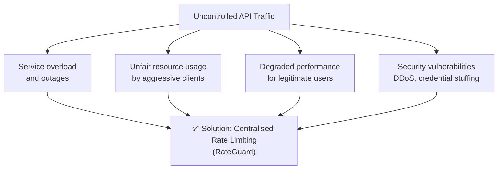
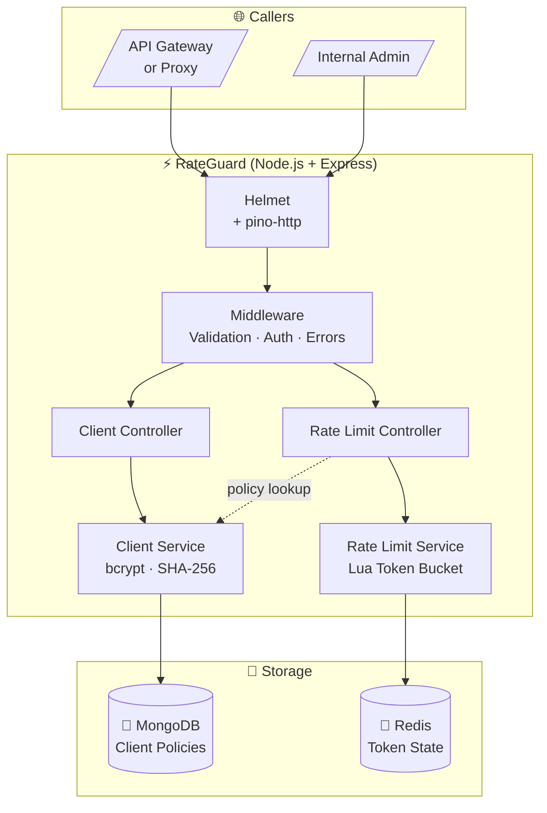
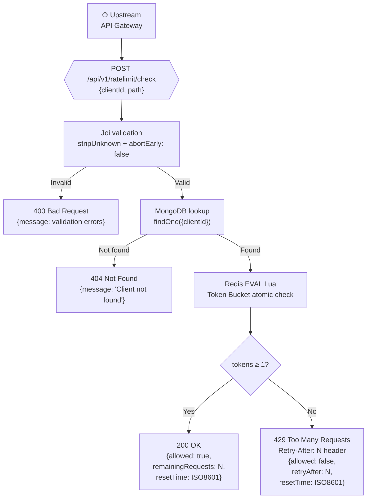
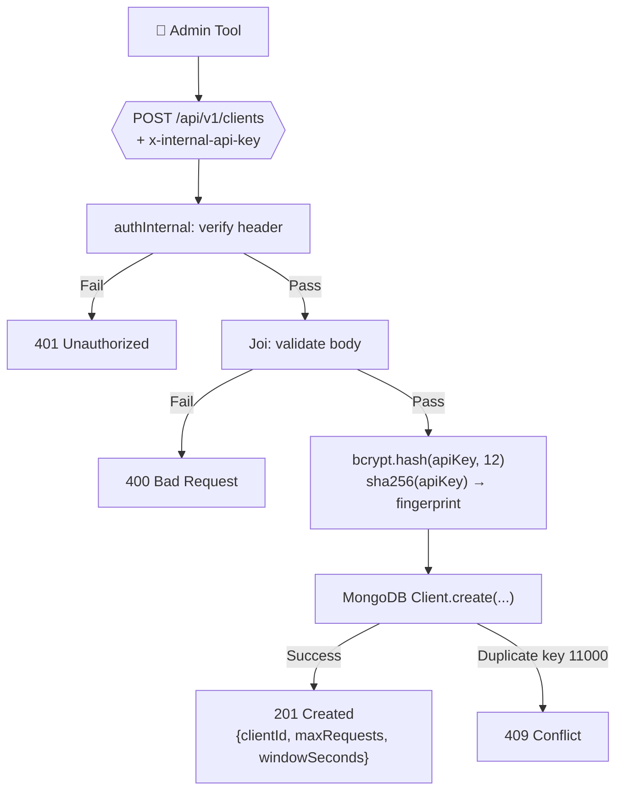
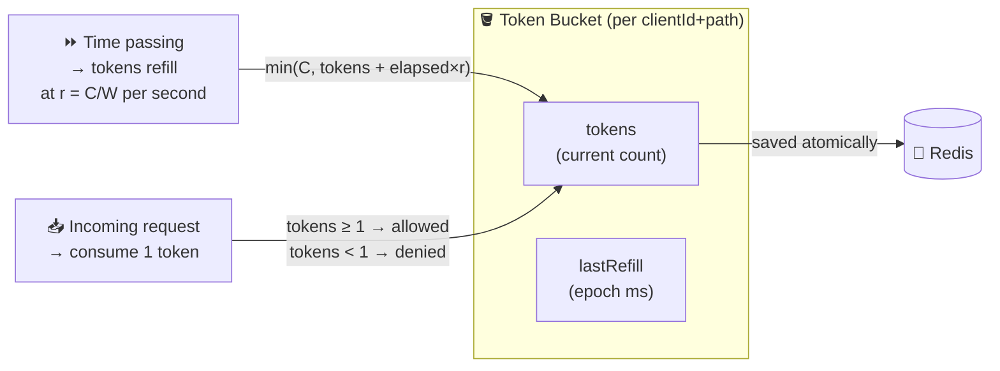
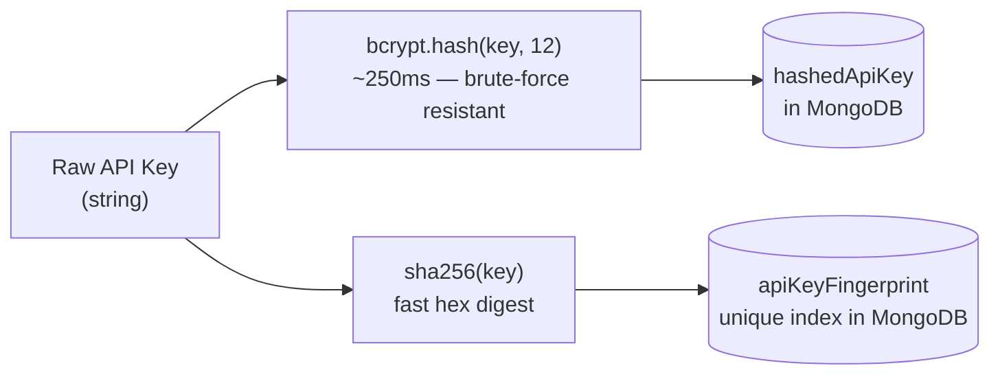
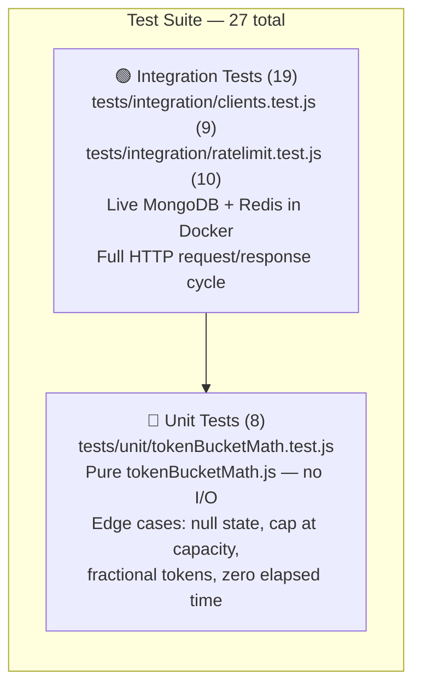
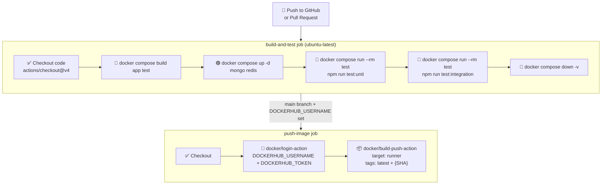

# 📋 Project Documentation — RateGuard Rate Limiting Microservice

---

## 1. Project Summary

**RateGuard** is a production-ready, distributed API rate limiting microservice built with Node.js, Express, MongoDB, and Redis. It provides centralised, per-client and per-path rate limit enforcement for distributed API ecosystems using the **Token Bucket algorithm** with **Redis Lua atomic operations**.

| Attribute | Value |
|---|---|
| **Type** | Backend Microservice |
| **Language** | JavaScript (Node.js 20 LTS) |
| **Framework** | Express 4 |
| **Algorithm** | Token Bucket (continuous refill, burst-friendly) |
| **Config Store** | MongoDB 7 (client policies) |
| **State Store** | Redis 7 (rate limit state) |
| **Containerisation** | Docker multi-stage build + Docker Compose |
| **CI/CD** | GitHub Actions |
| **Testing** | Jest + Supertest — 27 tests (8 unit + 19 integration) |

---

## 2. Problem Statement

In distributed systems and microservice architectures, uncontrolled API request volume poses serious risks:



**Without rate limiting:**
- A single misbehaving client can exhaust server resources
- Burst traffic spikes can cascade into full outages
- No fair-use enforcement across client tiers
- Individual services must reinvent rate limiting logic separately

**With RateGuard:**
- A single, consistent enforcement point for all upstream services
- Configurable per-client policies (different limits for free vs paid tiers)
- Accurate distributed decisions even across multiple service replicas
- No rate-limiting code inside individual business services

---

## 3. Goals and Non-Goals

### Goals
| # | Goal |
|---|---|
| G1 | Implement robust, burst-aware Token Bucket rate limiting |
| G2 | Ensure distributed correctness via Redis atomic Lua operations |
| G3 | Persist client policies securely in MongoDB |
| G4 | Provide a one-command Docker Compose setup for local development |
| G5 | Cover behaviour with unit and integration tests (all containerised) |
| G6 | Automate build, test, and image publishing via GitHub Actions CI/CD |
| G7 | Expose `/health` endpoint for orchestration health checks |

### Non-Goals
| # | Description |
|---|---|
| N1 | End-user authentication for downstream business APIs |
| N2 | Frontend UI or dashboard |
| N3 | Metrics/alerting (Prometheus/Grafana) — recommended but out of scope |
| N4 | Full Kubernetes deployment manifests |

---

## 4. System Architecture Overview



---

## 5. Functional Scope

### 5.1 Endpoint: Register Client

```
POST /api/v1/clients
Authorization: x-internal-api-key header required
```

| Behaviour | HTTP Code |
|---|---|
| Successful registration | `201 Created` |
| Duplicate `clientId` or `apiKey` | `409 Conflict` |
| Invalid / missing fields | `400 Bad Request` |
| Missing / wrong internal key | `401 Unauthorized` |
| Server error | `500 Internal Server Error` |

The `apiKey` is **never stored in plaintext** — it is hashed with bcrypt (cost 12) before persistence. A SHA-256 fingerprint additionally enforces API key uniqueness at the database index level.

### 5.2 Endpoint: Check Rate Limit

```
POST /api/v1/ratelimit/check
No authentication required (caller has already authenticated)
```

| Behaviour | HTTP Code |
|---|---|
| Request within limit | `200 OK` |
| Rate limit exceeded | `429 Too Many Requests` + `Retry-After` header |
| Unknown clientId | `404 Not Found` |
| Invalid / missing fields | `400 Bad Request` |
| Server error | `500 Internal Server Error` |

Each `clientId + path` combination has its own independent token bucket. Different paths for the same client do not share quota.

### 5.3 Endpoint: Health Check

```
GET /health
```

Reports MongoDB and Redis connection status. Returns `503` if either is unavailable. Used by Docker Compose, Kubernetes liveness probes, and load balancers.

---

## 6. End-to-End Data Flow



### Data flow for client registration



---

## 7. Internal Module Breakdown

| Module | File(s) | Key Responsibilities |
|---|---|---|
| **Entry point** | `server.js` | Connect to MongoDB + Redis, start HTTP server |
| **App wiring** | `app.js` | Register middleware, routes, health endpoint |
| **Configuration** | `config/index.js` | Parse and export all environment variables |
| **Logger** | `config/logger.js` | Pino structured logger with ISO timestamps |
| **Database** | `config/db.js` | Mongoose connect/disconnect helpers |
| **Cache** | `config/redis.js` | ioredis client with error/connect event logging |
| **Auth guard** | `middleware/authInternal.js` | Validate `x-internal-api-key` → 401 on failure |
| **Validation** | `middleware/validate.js` | Joi schema validation → 400 on error |
| **Error handler** | `middleware/errorHandler.js` | Normalise all errors to consistent JSON + logging |
| **Client model** | `models/Client.js` | Mongoose schema with unique indexes |
| **Client service** | `services/clientService.js` | bcrypt hashing, SHA-256 fingerprint, MongoDB persistence |
| **Rate service** | `services/rateLimitService.js` | Build Redis key, execute Lua EVAL, compute response fields |
| **Token math** | `services/tokenBucketMath.js` | Pure mathematical refill calculation (no I/O) |
| **Controllers** | `controllers/*.js` | Orchestrate services → shape HTTP response |
| **Routes** | `routes/*.js` | Register endpoints with middleware chain |
| **Utilities** | `utils/ApiError.js` | Custom Error class with HTTP status code |

---

## 8. Tech Stack Justification

| Technology | Version | Why Chosen |
|---|---|---|
| **Node.js** | 20 LTS | Non-blocking I/O ideal for API services; vast ecosystem |
| **Express** | 4 | Lightweight, explicit routing, rich middleware ecosystem |
| **MongoDB** | 7 | Flexible schema; efficient unique indexes; easy Mongoose integration |
| **Mongoose** | 8 | Schema validation, `timestamps`, unique index enforcement |
| **Redis** | 7 | Sub-millisecond latency; native Lua scripting for atomicity |
| **ioredis** | 5 | Production-grade Redis client with pipeline/scripting support |
| **bcryptjs** | 2 | Secure password hashing (cost 12 = ~250ms compute; brute-force resistant) |
| **Joi** | 17 | Declarative schema validation with clear error messages |
| **Pino** | 9 | Fastest Node.js structured logger; JSON output; built-in request ID |
| **Helmet** | 8 | One-line HTTP security header hardening |
| **Jest** | 29 | Fast, parallel-safe test runner with built-in assertions |
| **Supertest** | 7 | HTTP integration testing of Express apps without a running server |
| **Docker** | 27+ | Reproducible containerised environments |
| **Docker Compose** | v2 | Multi-service orchestration with health checks and dependencies |
| **GitHub Actions** | — | Native CI/CD; tight integration with Docker Hub and GitHub |

---

## 9. Token Bucket Algorithm — Deep Dive

### Concept

A token bucket is a virtual container with a fixed **capacity** (C). Tokens are added at a constant **refill rate** (r = C / W). Each incoming request uses 1 token. If no token is available, the request is rejected.



### Why atomic execution matters

Without atomicity, two concurrent requests could both read `tokens = 1`, both decide "allowed", and both subtract — resulting in `tokens = -1` (over-limit). RateGuard prevents this by executing the entire read-compute-write cycle as a **single Redis Lua `EVAL` call**, which Redis guarantees executes atomically.

---

## 10. Security Model

### API Key Security



| Concern | Mechanism |
|---|---|
| Plaintext storage | bcrypt irreversible hash (cost 12) |
| Duplicate keys cross-client | SHA-256 fingerprint + unique MongoDB index |
| Unauthorized registration | `x-internal-api-key` header check |
| Atomic rate decisions | Redis Lua `EVAL` |
| HTTP header attacks | Helmet middleware |
| Error leakage | Generic `500` externally; full stack trace only in server logs |
| Hardcoded credentials | All sensitive values via environment variables |

---

## 11. Testing Strategy

### Test pyramid



### Unit test scenarios (`tokenBucketMath.test.js`)

| Test | Asserts |
|---|---|
| Allows when capacity available | `allowed = true`, tokens ≥ 9 |
| Blocks when no tokens + no refill | `allowed = false`, tokens ≈ 0.2 |
| Allows after refill over time | `allowed = true`, tokens between 0 and capacity |
| First request with no prior state | Defaults to full capacity minus 1 |
| Tokens capped at capacity after long idle | `tokens ≤ capacity` always |
| Fractional token below request | `allowed = false` when 2.9 < 3 |
| Zero elapsed time — no change | Only requested tokens consumed |
| `lastRefillMs` equals `nowMs` | Output timestamp matches input |

### Integration test scenarios

**`clients.test.js` (9 tests)**
- 201 on successful registration
- Default values applied when maxRequests/windowSeconds omitted
- apiKey not present in response body
- 409 for duplicate `clientId`
- 409 for duplicate `apiKey` with different `clientId`
- 400 for invalid payload
- 400 for missing `clientId`
- 401 for missing internal key
- 401 for wrong internal key

**`ratelimit.test.js` (10 tests)**
- 200 then 200 then 429 (limit exhaustion)
- `remainingRequests` is integer
- ISO 8601 `resetTime` on 200
- ISO 8601 `resetTime` on 429
- Path isolation — different paths have independent buckets
- `Retry-After` header is parseable integer on 429
- 404 for unknown `clientId`
- 400 when `clientId` missing
- 400 when `path` missing
- 400 for empty strings

### Running tests

All tests execute inside the Docker test container against live services:

```bash
# All tests
docker compose run --rm test npm run test:all

# Unit only
docker compose run --rm test npm run test:unit

# Integration only
docker compose run --rm test npm run test:integration
```

### Test results (verified)

```
PASS  tests/unit/tokenBucketMath.test.js      8/8
PASS  tests/integration/clients.test.js       9/9
PASS  tests/integration/ratelimit.test.js    10/10

Test Suites: 3 passed, 3 total
Tests:       27 passed, 27 total
```

---

## 12. CI/CD Workflow



**Environment secrets to configure (GitHub → Settings → Secrets):**

| Secret | Description |
|---|---|
| `DOCKERHUB_USERNAME` | Your Docker Hub username |
| `DOCKERHUB_TOKEN` | Docker Hub access token (not password) |

If secrets are absent, the `push-image` job is skipped but `build-and-test` still runs on every push and PR.

---

## 13. Setup and Installation

### Prerequisites

- Docker Desktop (with Compose v2)
- Git

### One-command setup

```bash
git clone <repository-url>
cd my-ratelimit-service
cp .env.example .env          # optional: override defaults
docker compose up --build
```

Compose automatically:
1. Builds the multi-stage production image
2. Starts MongoDB and waits until healthy
3. Seeds 3 test clients (idempotent — safe on every restart)
4. Starts Redis and waits until healthy
5. Starts RateGuard on port `3000`

### Verify the stack

```bash
curl http://localhost:3000/health
# Expected: {"status":"ok","mongoOk":true,"redisOk":true}
```

---

## 14. Environment Variables Reference

| Variable | Default | Description |
|---|---|---|
| `PORT` | `3000` | HTTP listening port |
| `MONGO_URI` | `mongodb://mongo:27017/ratelimitdb` | MongoDB connection string |
| `REDIS_URL` | `redis://redis:6379` | Redis connection string |
| `DEFAULT_RATE_LIMIT_MAX_REQUESTS` | `100` | Default bucket capacity (if client omits maxRequests) |
| `DEFAULT_RATE_LIMIT_WINDOW_SECONDS` | `60` | Default window period (if client omits windowSeconds) |
| `INTERNAL_API_KEY` | `dev-internal-key` | Secret header for client registration |
| `LOG_LEVEL` | `info` | Pino log level: `trace`, `debug`, `info`, `warn`, `error`, `silent` |
| `NODE_ENV` | `development` | Runtime environment |

---

## 15. Usage Examples

### Register a new API client

```bash
curl -X POST http://localhost:3000/api/v1/clients \
  -H "Content-Type: application/json" \
  -H "x-internal-api-key: dev-internal-key" \
  -d '{
    "clientId":       "ecommerce-api",
    "apiKey":         "e-commerce-strong-key-abc123",
    "maxRequests":    100,
    "windowSeconds":  60
  }'
```

```json
// Response 201 Created
{
  "clientId": "ecommerce-api",
  "maxRequests": 100,
  "windowSeconds": 60
}
```

### Check rate limit (allowed)

```bash
curl -X POST http://localhost:3000/api/v1/ratelimit/check \
  -H "Content-Type: application/json" \
  -d '{"clientId": "ecommerce-api", "path": "/v1/products"}'
```

```json
// Response 200 OK
{
  "allowed": true,
  "remainingRequests": 99,
  "resetTime": "2026-03-02T09:01:00.000Z"
}
```

### Rate limit exceeded

```bash
# (After 100 requests within 60 seconds)
curl -v -X POST http://localhost:3000/api/v1/ratelimit/check \
  -H "Content-Type: application/json" \
  -d '{"clientId": "ecommerce-api", "path": "/v1/products"}'
```

```
HTTP/1.1 429 Too Many Requests
Retry-After: 3
```
```json
{
  "allowed": false,
  "retryAfter": 3,
  "resetTime": "2026-03-02T09:01:03.000Z"
}
```

### Use pre-seeded test clients (available immediately)

```bash
curl -X POST http://localhost:3000/api/v1/ratelimit/check \
  -H "Content-Type: application/json" \
  -d '{"clientId": "seed-client-pro", "path": "/api/test"}'
```

---

## 16. Verification Checklist

| # | Check | Command | Expected |
|---|---|---|---|
| 1 | Health endpoint | `curl http://localhost:3000/health` | `{"status":"ok"}` |
| 2 | Register client | `POST /api/v1/clients` with valid body | `201 Created` |
| 3 | Duplicate client | Register same `clientId` twice | `409 Conflict` |
| 4 | Missing auth | `POST /clients` without header | `401 Unauthorized` |
| 5 | Invalid payload | Empty `clientId` field | `400 Bad Request` |
| 6 | Rate limit allow | `POST /ratelimit/check` within limit | `200 OK`, `allowed: true` |
| 7 | Rate limit deny | Exceed the configured limit | `429`, `Retry-After` header present |
| 8 | Path isolation | Two different paths, same client | Each has own bucket |
| 9 | Unit tests | `docker compose run --rm test npm run test:unit` | 8 passed |
| 10 | Integration tests | `docker compose run --rm test npm run test:integration` | 19 passed |

---

## 17. Advantages and Limitations

### Advantages

| Advantage | Detail |
|---|---|
| Distributed correctness | Redis Lua atomicity — zero race conditions at scale |
| Horizontal scalability | Stateless app pods — scale independently |
| Burst handling | Token Bucket naturally accommodates traffic bursts |
| Separation of concerns | Policy storage (Mongo) decoupled from state (Redis) |
| Testability | Pure `tokenBucketMath.js` unit tested without any I/O |
| Developer experience | One-command setup, auto-seeded test data |
| Security-first | bcrypt hashing, fingerprint uniqueness, Helmet headers |

### Limitations and Mitigation

| Limitation | Mitigation |
|---|---|
| Redis is a single point of failure | Use Redis Sentinel / Cluster in production |
| Mongo adds latency per check (policy lookup) | Add in-process LRU cache for client policies |
| Internal API key is a simple string | Replace with mTLS or JWT for strict environments |
| No metrics dashboard | Add Prometheus exporter + Grafana |
| No IP-based limiting | Extend `clientId` to include IP for DDoS scenarios |

---

## 18. Production Readiness Roadmap

1. **Redis HA** — Redis Sentinel or Redis Cluster with AOF/RDB persistence
2. **Mongo Replica Set** — MongoDB Atlas or self-managed replica set
3. **Auth hardening** — mTLS between services or signed JWT for internal key
4. **Observability** — Prometheus `/metrics` (tokens consumed, 429 rate, latency)
5. **Tracing** — OpenTelemetry SDK with Jaeger/Tempo export
6. **Kubernetes** — Deployment + HPA for auto-scaling app pods
7. **Client policy cache** — In-process LRU (e.g. `lru-cache`) to avoid Mongo lookup per request
8. **Secrets management** — AWS Secrets Manager, HashiCorp Vault, or Kubernetes Secrets

---

## 19. Related Documents

| Document | Description |
|---|---|
| [README.md](README.md) | Quick start, usage examples, project overview |
| [ARCHITECTURE.md](ARCHITECTURE.md) | Deep-dive architecture decisions and diagrams |
| [API_DOCS.md](API_DOCS.md) | Full API reference with schemas and error codes |