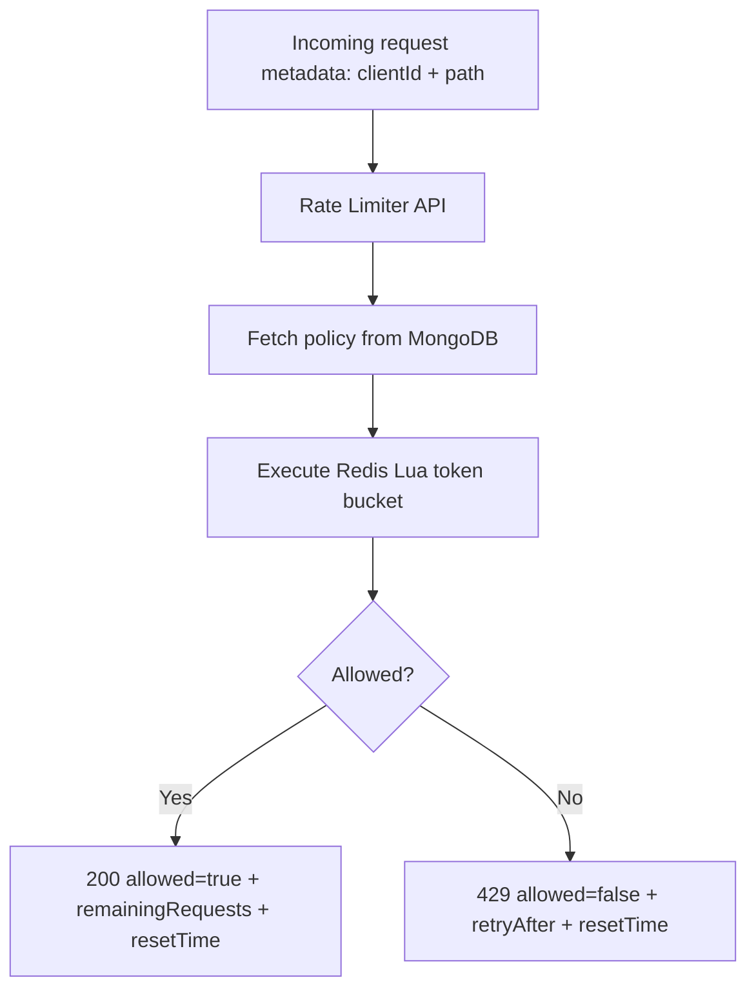
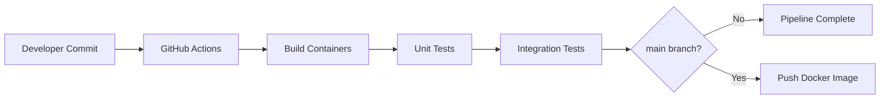

# Project Documentation

## 1. Project Summary

This project delivers a distributed and containerized API Rate Limiting Microservice that enforces per-client, per-path traffic policies. It is designed for backend resilience, predictable API behavior, and operational readiness with CI/CD.

## 2. Problem Statement

In distributed systems, uncontrolled API request volume can cause:

- Service instability and outages
- Unfair usage by aggressive clients
- Resource exhaustion under burst traffic

This microservice solves the problem by providing centralized rate-limit decisions with strong consistency across service instances.

## 3. Goals and Non-Goals

### Goals
- Implement robust Token Bucket rate limiting.
- Support distributed correctness via Redis atomic operations.
- Persist client policies securely in MongoDB.
- Provide production-like Docker and CI flow.
- Cover behavior with unit and integration tests.

### Non-Goals
- End-user authentication/authorization for business APIs.
- Frontend UI layer (project is backend microservice only).

## 4. Functional Scope

### Endpoint 1: Register Client
- `POST /api/v1/clients`
- Stores `clientId`, hashed API key, and policy values.
- Rejects duplicates with `409`.

### Endpoint 2: Check Rate Limit
- `POST /api/v1/ratelimit/check`
- Evaluates current allowance for `clientId + path`.
- Returns `200` when allowed, `429` when limited with `Retry-After`.

### Endpoint 3: Health
- `GET /health`
- Reports MongoDB and Redis readiness.

## 5. End-to-End Data Flow



## 6. Internal Module Breakdown

| Module | Responsibility |
|---|---|
| `config` | Environment parsing, logger setup, infrastructure connections |
| `middleware` | Validation, internal auth check, centralized error formatting |
| `models` | Mongo schemas and unique indexes |
| `services` | Client registration and rate-limit algorithm logic |
| `controllers` | API use-case orchestration and HTTP response shaping |
| `routes` | Endpoint registration and version scoping |
| `tests` | Unit and integration confidence checks |

## 7. Workflow Explanation

### Runtime workflow
1. Upstream sends request metadata (`clientId`, `path`).
2. Service validates payload.
3. Client policy is loaded from MongoDB.
4. Redis Lua script atomically computes token refill + consume.
5. Service responds with decision payload.

### Delivery workflow
1. Code pushed to repository.
2. GitHub Actions builds Docker images.
3. Unit and integration tests execute.
4. On `main`, image is pushed to Docker Hub.



## 8. Tech Stack Justification

- **Node.js + Express:** simple and efficient API orchestration.
- **Redis:** low-latency, atomic update capabilities with Lua.
- **MongoDB:** flexible policy schema and easy unique constraints.
- **Docker/Compose:** reproducible local and CI environments.
- **Jest/Supertest:** practical and fast backend testing.

## 9. Security and Stability Practices

- Bcrypt hashing for API keys.
- SHA-256 fingerprint uniqueness checks.
- Internal API key gate for client registration endpoint.
- Uniform error handling and non-leaky `500` responses.
- Structured logs with request IDs for debugging.

## 10. Advantages and Limitations

### Advantages
- Strong distributed consistency for rate decisions.
- Horizontal scalability with stateless API nodes.
- Fast runtime decisions.
- Clean project organization and maintainability.

### Limitations
- Requires Redis and Mongo operational availability.
- No built-in dashboard/UI.
- Internal key auth is minimal; can be replaced with mTLS/JWT for stricter environments.

## 11. Setup and Installation

### Prerequisites
- Docker Desktop
- Git

### Commands

```bash
git clone <repo-url>
cd my-ratelimit-service
cp .env.example .env
docker compose up --build
```

## 12. Usage Examples

### Create client

```bash
curl -X POST http://localhost:3000/api/v1/clients \
  -H "Content-Type: application/json" \
  -H "x-internal-api-key: dev-internal-key" \
  -d '{"clientId":"demo-client","apiKey":"super-strong-key-123","maxRequests":5,"windowSeconds":60}'
```

### Check allowance

```bash
curl -X POST http://localhost:3000/api/v1/ratelimit/check \
  -H "Content-Type: application/json" \
  -d '{"clientId":"demo-client","path":"/v1/orders"}'
```

## 13. Testing Strategy

### Unit tests
- Validate token bucket math and edge behavior.

### Integration tests
- Validate endpoint contracts and business outcomes:
  - success paths
  - duplicate conflict behavior
  - invalid payload behavior
  - exceeded-limit behavior
  - missing auth behavior

### Commands

```bash
docker compose run --rm test npm run test:unit
docker compose run --rm test npm run test:integration
docker compose run --rm test npm run test:all
```

## 14. Verification Checklist

- [ ] `GET /health` returns status `ok`
- [ ] Client registration returns `201`
- [ ] Duplicate client returns `409`
- [ ] Allowed requests return `200`
- [ ] Exceeded requests return `429` + `Retry-After`
- [ ] Invalid payload returns `400`
- [ ] All tests pass in Docker

## 15. Production Readiness Considerations

- Add retry/circuit-breaker policies at gateway layer.
- Add Redis persistence/replication strategy as per SLA.
- Add tracing and centralized metrics (Prometheus/OpenTelemetry).
- Harden internal authentication (mTLS/JWT).
- Add deployment manifests (Kubernetes/Terraform) for cloud rollout.

## 16. Related Documents

- [README.md](README.md)
- [architecture.md](architecture.md)
- [API_DOCS.md](API_DOCS.md)

This documentation package gives a complete, consistent, and professionally structured view of the project for onboarding, review, and deployment readiness.